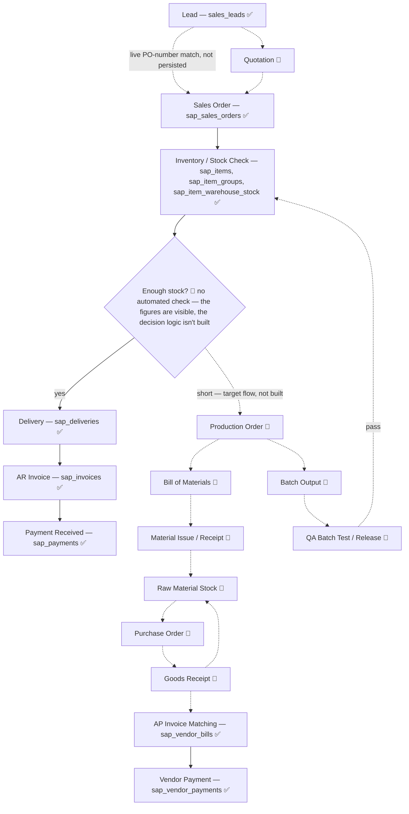

# End-to-End Operational Flow — Departments, Pages & Tables

A bird's-eye map of every real department's portal pages and the tables behind them — corrected 2026-09 after this doc was found to describe a generic, textbook SAP B1 lifecycle (Procurement/Warehouse/Production/QA modules, raw table codes, even a live "Quotations" page) that was never actually built in this codebase. Everything below is verified against the real route files, service/API files, and RPC SQL in this repo, and against `hyrax-data-platform`'s `config.py`/`data-dictionary.md`/`docs/sap-data-architecture-plans/README.md`.

**How to read this:** each department lists its real _pages_ and the _tables_ each page pulls from. Tables shown are this app's actual Supabase table names (the `sap_*` mirrors this repo's ingestion pipeline writes), with the raw SAP Business One source table code in parens on first mention (e.g. `sap_sales_orders (ORDR)`) for cross-reference — **not** the raw SAP code alone, since no code in either repo ever queries SAP directly by those codes. `(native)` means a table this app owns itself, not sourced from SAP. A page marked _stub_ has a real nav entry/route but no data wired up yet. For full column-level detail, see `hyrax-data-platform/docs/data-dictionary.md` (every SAP table's schema) and `docs/RPC-REFERENCE.md` (every dashboard RPC's exact fields) — this doc is the summary layer above both.

---

## Overall Flow (Overview)

This is the **full target architecture** — the whole intended lead-to-cash and procure-to-pay journey, including the parts that don't exist yet. Every node and edge is labeled ✅ (built and live in this app today) or 🔲 (target architecture only — no real table or page exists). Nothing below is omitted for being unbuilt; it's just marked.

**Legend:** ✅ built and live today. 🔲 named in the sibling `hyrax-data-platform` repo's own architecture-planning docs as the eventual target — no code, no schema, no page anywhere yet.

**Walking the whole diagram, built and not-built together:**

- **Lead → Sales Order (✅ both, but not actually linked):** a lead is real, a sales order is real, but there's no foreign key between them — it's a live match on PO number (`sales_leads.po_number` vs `sap_sales_orders.customer_ref`), computed on read in `SalesOrderSidebar.jsx`/`InvoiceSidebar.jsx`/`LeadSidebar.jsx`. The textbook intermediate step, Quotation, is 🔲 not built (SAP's own `OQUT`/`QUT1` module is deliberately unused) — today a lead goes straight to a sales order with no in-app quotation step at all.
- **Sales Order → Inventory Check (✅ built, the part this doc missed last pass):** `sap_items`/`sap_item_groups`/`sap_item_warehouse_stock` are real and extracted, and Operations Reports already surfaces stock position/backlog against open orders. What's 🔲 not built is the automated *decision* — nothing in this app checks "is there enough stock for this order" and reacts; that logic, and everything downstream of a shortfall, is target architecture only.
- **Shortfall → Production (🔲 entirely not built):** Production Order, its Bill of Materials, Material Issue/Receipt against raw material stock, Batch Output, and QA Batch Test/Release are all 🔲 — no table, no page, in either repo. A passing QA release would replenish finished-goods stock (feeding back into the same Inventory Check node) in the target design, but there's nothing to release today.
- **Raw materials → Procurement (🔲 entirely not built):** Purchase Order and Goods Receipt don't exist either — in the target design a Goods Receipt both replenishes raw material stock *and* is the document an AP invoice should match against.
- **AP Invoice Matching (✅ built, but standalone):** `sap_vendor_bills`/`sap_vendor_payments` are real and live in the Bills/Vendor Payments pages today — but disconnected from the target Goods Receipt above, since GRPO isn't extracted. A vendor bill in this app has no "where did this originate" document trail the way an AR invoice does back to a sales order.
- **In-stock path → Delivery → AR Invoice → Payment (✅ all real):** the actual live spine every Sales Order takes today when the shortfall branch never fires — `sap_deliveries` → `sap_invoices` → `sap_payments`, all directly SAP-mirrored and working end to end.

---

## Sales

_Owns the front half of the real spine — CRM lead through to a live sales order._

| Page                      | Route                          | Tables / Source                                                                                                                                                                                                                                                                                                                                                                                                                           |
| ------------------------- | ------------------------------ | ----------------------------------------------------------------------------------------------------------------------------------------------------------------------------------------------------------------------------------------------------------------------------------------------------------------------------------------------------------------------------------------------------------------------------------------- |
| Sales Reports (dashboard) | `/app/sales/reports`           | RPC `get_sales_reports_dashboard` → `sales_leads` (native), `clients` (native), `sales_targets`/`sales_budgets` (native), `employee_sales_rep_mapping` (native), `sap_customers (OCRD)`, `sap_sales_orders (ORDR)`, `sap_sales_order_lines (RDR1)`, `sap_invoices (OINV)`, `sap_invoice_lines (INV1)`, `sap_items (OITM)`, `sap_item_groups (OITB)`, `sap_sales_persons (OSLP)`, `sap_payments (ORCT)`, `sap_payment_applications (RCT2)` |
| Clients — Prospects       | `/app/sales/clients/prospects` | `clients` (native)                                                                                                                                                                                                                                                                                                                                                                                                                        |
| Clients — SAP             | `/app/sales/clients/sap`       | `sap_customers (OCRD)`                                                                                                                                                                                                                                                                                                                                                                                                                    |
| Leads — Overview          | `/app/sales/leads/overview`    | `sales_leads` (native)                                                                                                                                                                                                                                                                                                                                                                                                                    |
| Leads — List              | `/app/sales/leads/list`        | `sales_leads_with_closed_date` (native view), `clients`, `employees_public`, `lead_source_types`, `sales_leads_lose_reasons` (native)                                                                                                                                                                                                                                                                                                     |
| Sales Targets             | `/app/sales/leads/targets`     | `sales_targets` (native); RPC `get_sales_targets_prorated`                                                                                                                                                                                                                                                                                                                                                                                |
| Sales Orders — All        | `/app/sales/orders/all`        | `sap_sales_orders (ORDR)`, `sap_sales_order_lines (RDR1)`, `sap_delivery_lines (DLN1)`, `sap_invoice_lines (INV1)`, `employee_sales_rep_mapping` (native); RPC `get_sales_orders_overview` for the KPI cards                                                                                                                                                                                                                              |
| Sales Budgets             | `/app/sales/orders/budgets`    | `sales_budgets` (native)                                                                                                                                                                                                                                                                                                                                                                                                                  |
| Sales Rep Mapping         | `/app/sales/rep-mapping`       | `employee_sales_rep_mapping` (native)                                                                                                                                                                                                                                                                                                                                                                                                     |
| Sales Guides              | `/app/sales/guides`            | static content, no table                                                                                                                                                                                                                                                                                                                                                                                                                  |
| Quotations                | `/app/sales/quotations`        | _Stub — nav placeholder only._ Hyrax deliberately doesn't use SAP's own quotation module (`OQUT`/`QUT1`); this is reserved for a possible future in-app quotation feature.                                                                                                                                                                                                                                                                |

---

## Finance

_Closes the real spine — AR collection and the standalone AP side. 100% SAP-mirrored — Finance has no native tables of its own._

| Page                                                                       | Route                                                                                                           | Tables / Source                                                                                                                                                                                                                                                                                                                                                                                            |
| -------------------------------------------------------------------------- | --------------------------------------------------------------------------------------------------------------- | ---------------------------------------------------------------------------------------------------------------------------------------------------------------------------------------------------------------------------------------------------------------------------------------------------------------------------------------------------------------------------------------------------------- |
| Invoices                                                                   | `/app/finance/invoices`                                                                                         | `sap_invoices (OINV)`, `sap_invoice_lines (INV1)`, `sap_delivery_lines`; RPC `get_invoices_overview` for the KPI cards                                                                                                                                                                                                                                                                                     |
| Payments                                                                   | `/app/finance/payments`                                                                                         | `sap_payments (ORCT)`, `sap_payment_applications (RCT2)`, `sap_invoices`                                                                                                                                                                                                                                                                                                                                   |
| Bills (AP)                                                                 | `/app/finance/bills`                                                                                            | `sap_vendor_bills (OPCH)`, `sap_vendor_bill_lines (PCH1)`; RPC `get_bills_overview` for the KPI cards                                                                                                                                                                                                                                                                                                      |
| Vendor Payments (AP)                                                       | `/app/finance/vendor-payments`                                                                                  | `sap_vendor_payments (OVPM)`, `sap_vendor_payment_applications (VPM2)`, `sap_vendor_bills`                                                                                                                                                                                                                                                                                                                 |
| Journal Entries                                                            | `/app/finance/journal-entries`                                                                                  | `sap_gl_journal_entries (OJDT)`, `sap_gl_journal_lines (JDT1)`                                                                                                                                                                                                                                                                                                                                             |
| Chart of Accounts                                                          | `/app/finance/chart-of-accounts`                                                                                | `sap_gl_accounts (OACT)`                                                                                                                                                                                                                                                                                                                                                                                   |
| Financial Reports / Cash Flow Statement / Balance Sheet / Income Statement | `/app/finance/reports`, `/app/finance/cash-flow`, `/app/finance/balance-sheet`, `/app/finance/income-statement` | **All four routes share one RPC**, `get_finance_dashboard` → `sap_invoices`, `sap_payments`, `sap_payment_applications`, `sap_vendor_bills`, `sap_vendor_payments`, `sap_vendor_payment_applications`, `sap_gl_accounts`, `sap_bank_account_movements (OBNK)`, plus materialized views `mv_gl_monthly_account_summary`/`mv_gl_monthly_balance_sheet_snapshot` — not four independently-computed statements |
| Claims Management                                                          | `/app/finance/claims-management`                                                                                | _Stub — not built._                                                                                                                                                                                                                                                                                                                                                                                        |

---

## Operations

_Real module name — replaces the old doc's fictional "Warehouse & Logistics"/"Order Fulfillment" pages. One page today: stock/backlog reporting, not a dedicated warehouse module._

| Page               | Route                     | Tables / Source                                                                                                                                                                                                       |
| ------------------ | ------------------------- | --------------------------------------------------------------------------------------------------------------------------------------------------------------------------------------------------------------------- |
| Operations Reports | `/app/operations/reports` | RPC `get_operations_dashboard` → `sap_sales_orders`, `sap_sales_order_lines`, `sap_deliveries (ODLN)`, `sap_delivery_lines (DLN1)`, `sap_invoices`, `sap_invoice_lines`, `sap_items (OITM)`, `sap_item_groups (OITB)` |

`sap_item_warehouse_stock (OITW)` — per-warehouse on-hand/committed/on-order quantity — is extracted, but this dashboard's stock figures are still company-wide via `sap_items`, not yet broken out per warehouse.

---

## HR

_Fully native — Hyrax doesn't run SAP's HR module at all, so `OHEM`/`OUDP`/`OUBR` are essentially unused here. Legacy HR data may be migrated in later, per `CLAUDE.md`._

| Page                         | Route                                | Tables / Source                                                                                                                                                          |
| ---------------------------- | ------------------------------------ | ------------------------------------------------------------------------------------------------------------------------------------------------------------------------ |
| Employee Overview            | `/app/hr/employees/overview`         | RPC `get_hr_employees_dashboard` → `employees`, `departments`, `employment_status`, `employment_type`, `nationalities`, `termination_reason`                             |
| Employee Management (list)   | `/app/hr/employees/list`             | `employees`; lookups: `departments`, `employment_status`, `employment_type`, `identification_type`, `nationalities`, `termination_reason`, `work_locations`, `addresses` |
| Attendance Overview          | `/app/hr/attendance/overview`        | `unified_daily_attendance`, `attendance_activity_audit` (views)                                                                                                          |
| Attendance Management (list) | `/app/hr/attendance/list`            | `unified_daily_attendance`, `attendance_activity_audit`; both fed by Vigilance IoT's `attendance_logs` (raw biometric door-scanner log — see `docs/RPC-REFERENCE.md`)    |
| HR Reports                   | `/app/hr/reports`                    | RPC `get_hr_reports_dashboard` → `employees`, `departments`, `employee_lifecycle_cases`, `leave_ledger_entries`, `leave_ledger_types`, `unified_daily_attendance`        |
| Organization Chart           | `/app/hr/organization-chart`         | `employees` (self-referencing `manager_id`)                                                                                                                              |
| Leave Management             | `/app/hr/leaves`                     | `leave_ledger_entries`, `leave_ledger_types` (populated from a manual HR2000 CSV import, not SAP)                                                                        |
| Onboarding / Offboarding     | `/app/hr/onboarding`, `/offboarding` | `employee_lifecycle_cases_with_progress` (view), `employee_lifecycle_case_items`                                                                                         |
| Departments                  | `/app/hr/departments`                | _Stub — not built._                                                                                                                                                      |
| Recruitment                  | `/app/hr/recruitment`                | _Stub — not built._                                                                                                                                                      |
| Performance                  | `/app/hr/performance`                | _Stub — not built._                                                                                                                                                      |

---

## IT

_Fully native — no SAP tables anywhere in this module. A future sync with ManageEngine Endpoint Central Cloud is possible per `CLAUDE.md`, not built yet._

| Page                     | Route                                | Tables / Source                                                                                                                                                  |
| ------------------------ | ------------------------------------ | ---------------------------------------------------------------------------------------------------------------------------------------------------------------- |
| IT Dashboard             | `/app/it/dashboard`                  | static quick-links widget, no table                                                                                                                              |
| IT Assets — Overview     | `/app/it/assets/overview`            | `it_assets`                                                                                                                                                      |
| IT Assets — List         | `/app/it/assets/list`                | `it_assets`; lookups: `it_asset_category`, `it_asset_subcategory`, `it_asset_condition`, `it_asset_manufacturer`, `it_asset_operating_system`, `it_asset_status` |
| Onboarding / Offboarding | `/app/it/onboarding`, `/offboarding` | shared with HR — `employee_lifecycle_cases_with_progress`, `employee_lifecycle_case_items`                                                                       |
| Software Management      | `/app/it/software`                   | _Stub — not built._                                                                                                                                              |

---

## Workspace

_Not in the original doc at all — fully native, project/task management. The first true many-to-many relationships in this schema (`project_members`/`task_assignees`); RLS-gated by project membership, not by department, unlike every other module here._

| Page                                         | Route                                                          | Tables / Source                                                                                                    |
| -------------------------------------------- | -------------------------------------------------------------- | ------------------------------------------------------------------------------------------------------------------ |
| Projects                                     | `/app/workspace/projects`                                      | `projects`, `projects_with_progress` (view), `project_departments`, `project_members`; RPC `get_projects_overview` |
| Project Detail — Tasks / Members / Documents | `/app/workspace/projects/:projectId/{tasks,members,documents}` | `tasks`, `project_members`, `documents_with_context` (view)                                                        |
| My Tasks                                     | `/app/workspace/tasks`                                         | `tasks`, `task_assignees`; RPC `get_my_tasks_overview`                                                             |
| Documents                                    | `/app/workspace/documents`                                     | `documents_with_context` (view), `documents`                                                                       |

---

## General / Cross-Department

_Not in the original doc — pages that don't belong to one single department._

| Page                           | Route                               | Tables / Source                                         |
| ------------------------------ | ----------------------------------- | ------------------------------------------------------- |
| Home Dashboard                 | `/app`                              | static content, no table                                |
| Announcements                  | `/app/announcements`                | static content, no table                                |
| Notifications                  | `/app/notifications`                | `notifications`                                         |
| Employee Directory             | `/app/employees`, `/app/department` | `employees_public` (view)                               |
| Help (FAQ / Guides / Glossary) | `/app/help/*`                       | static content, no table                                |
| Superadmin — Users             | `/app/system/users`                 | `profiles`, `employees`; lookups `departments`, `roles` |
| Superadmin — Pipeline Status   | `/app/system/pipeline-status`       | `sap_pipeline_state`, `pipeline_run_log`                |

---

## Not Yet Built — Target Architecture

The 🔲 nodes in the flow diagram above, department by department. None of the rows below have a real page or a single extracted SAP table in either repo today — they're listed because `hyrax-data-platform`'s own `docs/sap-data-architecture-plans/README.md` (§8, "Current Build State & Scope Notes") names them as the eventual target, not because any of it exists yet.

| Department                 | Would-be SAP tables                                                                                                                                            | Notes                                                                                                                                                                                                                |
| -------------------------- | -------------------------------------------------------------------------------------------------------------------------------------------------------------- | -------------------------------------------------------------------------------------------------------------------------------------------------------------------------------------------------------------------- |
| Procurement                | Purchase Order (`OPOR`/`POR1`), Goods Receipt (`OPDN`/`PDN1`)                                                                                                  | AP Invoice Matching is already real (`sap_vendor_bills`), just not linked back to a PO/GRPO — the AP mirror is standalone.                                                                                           |
| Warehouse (bins/transfers) | Bin & Batch Locations (`OBIN`/`OBTL`/`OIBT`), Stock Transfers (`OWTR`/`WTR1`), Inventory Movements (`OINM`)                                                    | `sap_item_warehouse_stock` (per-warehouse quantity) is real; bin-level and transfer/movement detail is not.                                                                                                          |
| Production                 | Production Orders (`OWOR`/`WOR1`), Bill of Materials (`OITT`/`ITT1`), Material Issue/Receipt (`OIGE`/`OIGN`), Batch Output/Traceability (`OBTN`/`OITL`/`ITL1`) | Not built.                                                                                                                                                                                                           |
| QA                         | Batch Test/COA, Pass/Fail tracking                                                                                                                             | Not built — `fact_qc_test` was only ever a hypothetical name in a design doc's proposed star schema, never a real table.                                                                                             |
| Returns                    | Sales Returns (`ORIN`/`RIN1`), AP Credit Memos (`ORPD`/`RPD1`)                                                                                                 | Confirmed unextracted — these are the polymorphic FK values on `sap_payment_applications`/`sap_vendor_payment_applications` that `data-dictionary.md` explicitly documents as "point elsewhere, not extracted here." |

HR/IT raw SAP master data (`OHEM`/`OUDP`/`OUBR`) is deliberately excluded from this table — per the architecture README, Hyrax doesn't intend to ever run SAP's HR module, so this isn't "not yet built," it's "not planned."
