# Employee Lifecycle Checklist Architecture

**Status:** Built (2026-09), then hardened (2026-09-02) after a deep audit found the offboarding trigger's core assumption about `resignation_date` didn't match how that field is actually used anywhere else in this codebase — see "Hardening pass" below for the full list of fixes. Deployment (running the SQL against the live Supabase project) is a separate manual step, see [`docs/setup/EMPLOYEE-LIFECYCLE-CHECKLIST-DEPLOYMENT-GUIDE.md`](./setup/EMPLOYEE-LIFECYCLE-CHECKLIST-DEPLOYMENT-GUIDE.md). Reviewed and amended (2026-09) after a dedicated verification pass caught a schema error (this doc originally specified `bigint` ids/FKs — `employees.id` is actually `uuid`, corrected throughout below) and several real design gaps, now resolved: a manual status-override path, handling for simultaneous onboarding+offboarding cases, a deploy-time backfill for pre-existing employees, and — the most consequential gap — integration with the existing HR Employee Management and IT Asset Management pages, without which this design's own new pages would just become a second place to remember to check. See "Employee Management & IT Asset Management integration" below. Supersedes the "dedicated onboarding checklist/wizard UI" exclusion in [`ONBOARDING-WORKFLOW-ARCHITECTURE.md`](./ONBOARDING-WORKFLOW-ARCHITECTURE.md)'s Non-goals section — that is now this project — and resolves that doc's own open TODO about offboarding, which had zero prior art (no doc, table, route, or code) anywhere in this repo or the sibling `hyrax-data-platform` repo before this design. Builds directly on top of that doc's Section A (live) and Section B (designed, not built), and reuses the notification engine from [`NOTIFICATIONS-ARCHITECTURE.md`](./NOTIFICATIONS-ARCHITECTURE.md) and UI/data-model patterns established in [`PROJECTS-TASKS-ARCHITECTURE.md`](./PROJECTS-TASKS-ARCHITECTURE.md) (Workspace Tasks) as-is, without changing either.

## The problem

`ONBOARDING-WORKFLOW-ARCHITECTURE.md` designs _notifications_ for a handful of discrete moments in a new hire's setup (a profile needing a department, an employee needing linking, IT needing to know a device is required) — but nobody, not HR, not IT, not the new hire themself, has anywhere to look and see the _whole picture_ of where one specific person's onboarding actually stands right now. The doc's own "Full Proper Onboarding Lifecycle" section lists an 11-step flow and then trails off into an undesigned "new hire should undergo HR onboarding, IT onboarding" phase with no checklist behind it at all.

Offboarding is worse: it doesn't exist. There's no signal anywhere that revokes access, returns equipment, or closes out HR/finance obligations when someone resigns or is terminated — nothing beyond the bare fact that `employees.employment_status_id` eventually gets set to a terminal value, usually well after the fact. The existing doc's own blockquoted TODO names this directly: _"HR side of things that would help in offboarding properly... what other things are missing from this onboarding that is essential... and would aid in proper offboarding procedures."_

This document designs one feature that answers both: a shared, always-current **checklist per employee per lifecycle event** (onboarding or offboarding), visible to HR, IT, and the employee, each seeing the parts relevant to them.

## Visual overview: the whole module, end to end

How to read this: **parallelograms** are a human clicking something in the UI; **hexagons** are a `pg_cron` scheduled scan (runs daily, on its own, with no human action); plain **rectangles** are a database trigger or function firing automatically; **diamonds** are a decision point; **subroutine boxes** (double-bordered) are a notification being emitted; **stadium/pill shapes** are a terminal outcome (a state that doesn't automatically proceed further on its own). Dotted arrows call out a nuance rather than a direct flow.

```mermaid
flowchart TD
    A1(["New employees row INSERT"]) --> A2{"employment_status = Probation,<br/>OR join_date within last 30 days?"}
    A2 -->|No| A2x(["No onboarding case opened<br/>-- guards against a future bulk<br/>historical-data migration"])
    A2 -->|Yes| ON1["get_or_create_onboarding_case&#58;<br/>seeds all 12 fixed items"]

    G1[/"HR clicks<br/>Begin Offboarding, Notice"/] --> G1m["Modal collects&#58;<br/>expected last day + reason"]
    G1m --> G1u["employees UPDATE&#58;<br/>employment_status_id = 13"]

    G2[/"HR clicks<br/>Immediate Termination"/] --> G2m["Modal collects&#58;<br/>expected last day + reason"]
    G2m --> G2u["employees UPDATE&#58;<br/>employment_status_id = 4"]

    G3[/"HR clicks<br/>Finalize Departure"/] --> G3m["Modal collects&#58;<br/>final status, 4, 5, or 6"]
    G3m --> G3u["employees UPDATE&#58;<br/>employment_status_id = 4, 5, or 6"]

    D1(["Direct DB edit / CSV import&#58;<br/>resignation_date newly set<br/>-- backward-compat safety net,<br/>not the guided UI path"])

    G1u & G2u & G3u & D1 --> TRIG{{"AFTER UPDATE ON employees&#58;<br/>handle_employee_offboarding_case_open"}}
    TRIG -->|"Branch 1&#58; resignation_date set"| MATCH(("any branch<br/>matched"))
    TRIG -->|"Branch 2&#58; status becomes 13"| MATCH
    TRIG -->|"Branch 3&#58; status becomes any<br/>terminated-category value"| MATCH
    MATCH --> OFF2

    SCAN0{{"Daily scan&#58; check_employee_contract_offboarding_due<br/>non-full-time employment_type,<br/>end_date within 30 days"}} --> OFF2

    OFF2["get_or_create_offboarding_case&#58;<br/>find this employee's OPEN case,<br/>or create one"] --> NEWCHK{"Was a NEW case<br/>just created?"}
    NEWCHK -->|"No -- already open"| NOOP(["No-op&#58; the existing case<br/>just continues unchanged"])
    NEWCHK -->|Yes| SEED["Seed all 13 fixed items&#59;<br/>expected_last_day =<br/>coalesce&#40;end_date, resignation_date&#41;"]

    G1m -.->|"guided actions ALSO write expected_last_day<br/>directly onto the case afterward --<br/>never onto employees.end_date"| SEED
    G2m -.-> SEED

    SEED --> CANCELON["Auto-CANCEL any still-OPEN<br/>ONBOARDING case for this employee"]
    CANCELON --> ONCANCELLED(["Onboarding case -&gt; CANCELLED<br/>-- confirmed real scenario, not rare&#58;<br/>resigning while still mid-Probation"])
    SEED --> NOTIFY1[["Notify HR + manager&#58;<br/>offboarding_case_opened"]]
    SEED --> NOTIFY2[["Notify IT&#58;<br/>offboarding_it_revocation_needed"]]
    SEED -.->|"while this case stays OPEN"| SUPPRESS(["employee.confirmation_due_soon /<br/>_overdue scans skip this employee --<br/>no more contradictory 'review probation'<br/>nudges once offboarding has started"])

    D2(["resignation_date cleared back to null<br/>AND status returns to an active category"]) --> RETRACT["Auto-CANCEL the OPEN<br/>OFFBOARDING case&#58;<br/>closed_reason = resignation_retracted"]

    subgraph SG_ON["Onboarding checklist -- 12 fixed items"]
        ON2["Checklist in progress&#58;<br/>most items MANUAL &#40;HR/IT tick off&#41;,<br/>2 items DERIVED &#40;auto-synced&#41;"]
        ONS1(["employees.profile_id set"]) --> OND1["profile_linked -&gt; DONE"]
        ONS2(["profiles.role_id / department_id<br/>changed off the staff/General defaults"]) --> OND2["role_department_assigned -&gt; DONE"]
        ONS3(["it_assets.asset_user_id set<br/>-- only if needs_it_asset = true"]) --> OND3["it_asset_assigned -&gt; DONE"]
        ON2 & OND1 & OND2 & OND3 --> ONCHECK{"Every one of the 12 items<br/>now DONE or SKIPPED?"}
        ONCHECK -->|Not yet| ON2
        ONCHECK -->|Yes| ONDONE(["Case -&gt; COMPLETED"])
        ONDONE --> ONNOTIFY[["Notify HR + the new hire&#58;<br/>onboarding_checklist_completed"]]
        ONDONE -.-> ONPROB(["Read-only line stays visible&#58;<br/>'Probation review due&#58; &#91;date&#93;'<br/>-- a separate system, not re-implemented here"])
    end
    ON1 --> ON2

    subgraph SG_OFF["Offboarding checklist -- 13 fixed items"]
        OFF6["Checklist in progress&#58;<br/>most items MANUAL,<br/>2 items DERIVED &#40;auto-synced&#41;"]
        OFFS1(["Every it_assets row for this<br/>employee has asset_user_id cleared"]) --> OFFD1["it_assets_returned -&gt; DONE"]
        OFFBTN[/"IT or superadmin clicks<br/>Deactivate Portal Account"/] --> OFFRPC["deactivate_profile RPC&#58;<br/>sets profiles.deactivated_at"]
        OFFRPC --> OFFD2["portal_account_deactivated -&gt; DONE"]
        OFF6 & OFFD1 & OFFD2 --> OFFCHECK{"Every one of the 13 items<br/>now DONE or SKIPPED?"}
        OFFCHECK -->|Not yet| OFF6
        OFFCHECK -->|Yes| OFFDONE(["Case -&gt; COMPLETED"])
        OFFDONE --> OFFNOTIFY[["Notify HR + superadmin&#58;<br/>offboarding_case_completed"]]
    end
    SEED --> OFF6
    G3u -.->|"Finalize Departure re-triggers this same<br/>flow, but the case already exists --<br/>NEWCHK says No, so it's just a<br/>status update, not a new case"| TRIG

    subgraph SG_SCAN["Daily escalation scans -- only while the OFFBOARDING case stays OPEN"]
        SCANA{{"expected_last_day within 7 days,<br/>IT-owned items still pending"}} --> SCANAN[["Notify IT&#58;<br/>offboarding_last_day_approaching"]]
        SCANB{{"expected_last_day already passed,<br/>case still OPEN"}} --> SCANBN[["Notify HR + IT + superadmin&#58;<br/>offboarding_overdue"]]
    end
    SEED --> SCANA
    SEED --> SCANB

    subgraph SG_VIS["Employee self-service visibility"]
        VIS1{"employee_can_view = true?<br/>-- HR flips this manually for offboarding,<br/>can stay OPEN internally before the<br/>employee is even told"}
        VIS1 -->|No| VISNONE(["Employee sees nothing at<br/>/app/employee/offboarding"])
        VIS1 -->|Yes| VIS2["Employee sees only items flagged<br/>employee_visible = true --<br/>e.g. 'return your laptop by...',<br/>never internal HR/security items"]
        VIS3(["Onboarding&#58; employee_can_view<br/>defaults to true immediately"]) --> VIS4["Employee sees a simplified<br/>4-milestone rollup at<br/>/app/employee/onboarding"]
    end
    SEED --> VIS1
    ON1 --> VIS3

    classDef guided fill:#cfe8ff,stroke:#4a90d9,color:#111
    classDef scan fill:#e6d9f2,stroke:#8e44ad,color:#111
    classDef notify fill:#d9f2d9,stroke:#3fa34d,color:#111
    classDef terminal fill:#f8d7da,stroke:#c0392b,color:#111
    classDef decision fill:#fff3cd,stroke:#d4a017,color:#111
    class G1,G2,G3,OFFBTN guided
    class SCAN0,SCANA,SCANB scan
    class NOTIFY1,NOTIFY2,ONNOTIFY,OFFNOTIFY,SCANAN,SCANBN notify
    class A2x,NOOP,ONCANCELLED,SUPPRESS,VISNONE,D1,D2 terminal
    class A2,NEWCHK,ONCHECK,OFFCHECK,VIS1 decision
```



The three offboarding entry paths (guided buttons, a direct field edit, or the daily contract-expiration scan) all converge on the exact same `get_or_create_offboarding_case()` function and the same idempotency check — there is only ever one way a case actually gets created, no matter which of the four things triggered it. The two checklists' completion logic is identical in shape (every item DONE or SKIPPED closes the case) but genuinely different in content, which is why they're drawn as separate subgraphs rather than one shared box.

## Why one unified case, not separate HR/IT checklists

The natural-seeming alternative — an "HR onboarding checklist" and a separate "IT onboarding checklist" — was rejected. The 11-step flow already documented alternates ownership constantly: HR creates the employee row, IT creates the Workspace account, HR _and_ IT link the profile, IT _or_ superadmin assigns role/module access. Two independently-modeled checklists would need their own synchronization mechanism to answer "has the other side finished yet" — exactly the coordination failure the existing doc's own intro complains about ("nobody is told when a new person shows up").

This app has already solved the equivalent problem once, deliberately, in `PROJECTS-TASKS-ARCHITECTURE.md`: **visibility and permission tier are separate axes.** Every project member (owner/lead/member/cc) sees the same task list; only who can _act_ on a given task differs (assignee-only). This design applies the identical split: one case per employee per lifecycle event, one checklist of items inside it, each item tagged with an `owner` (`HR` / `IT` / `superadmin` / `employee` / `system`). HR's view, IT's view, and the employee's own view are each a **filtered slice of the same case** — never three copies of "what's the state of this person's setup" that can silently drift apart.

## Scope decisions locked in for v1

Four constraints, confirmed with the product owner, shape every choice below:

1. **This document is the deliverable of this pass.** No schema, triggers, or UI ship this round — this is the buildable spec for a later implementation pass.
2. **Automation is portal-native only.** Anything expressible inside this app's own Postgres database — status derived from a real fact, a notification fired — is fair game. No real third-party API integration (no Google Workspace Admin SDK calls, no GitHub API calls) is designed here; every external-system step (creating a Workspace account, revoking a GitHub seat) stays a manual human action, checked off in the portal after being notified, exactly like every other automation already built in this codebase.
3. **Offboarding formally begins at resignation/notice submission**, before the employee's actual last day — giving HR/IT lead time to prepare, so access is revoked _on_ the last day rather than sometime after it.
4. **The checklist is fixed and built-in for v1** — one hardcoded onboarding checklist, one hardcoded offboarding checklist, identical for every employee. No admin UI to author custom items or per-department templates exists in this design; item definitions live in code, not in an editable database table.

## Data model

### `employee_lifecycle_cases`

One row per onboarding or offboarding attempt for one employee.

| column                                    | type                                                           | notes                                                                                                                                                                                                                                                                                                                                                                                                                                                                                                                                                                                                                                                                                                                                          |
| ----------------------------------------- | -------------------------------------------------------------- | ---------------------------------------------------------------------------------------------------------------------------------------------------------------------------------------------------------------------------------------------------------------------------------------------------------------------------------------------------------------------------------------------------------------------------------------------------------------------------------------------------------------------------------------------------------------------------------------------------------------------------------------------------------------------------------------------------------------------------------------------- |
| `id`                                      | uuid PK, default `gen_random_uuid()`                           |                                                                                                                                                                                                                                                                                                                                                                                                                                                                                                                                                                                                                                                                                                                                                |
| `employee_id`                             | uuid FK → `employees(id)`                                      | Anchored on `employees`, not `profiles` — an onboarding case starts (HR creates the employee row) before a `profiles` row exists at all, per the existing flow's own step ordering. Every other assignment-style table in this schema (`it_assets.asset_user_id`, `attendance_activities.employee_id`) already anchors on `employees` for the same reason. **`employees.id` is `uuid`**, not `bigint` — confirmed live (the same wrong assumption `link_profile_to_employee.sql` had to fix in 2026-08); every id/FK in this design uses `uuid`, matching the Workspace/Projects-era convention (`project_members`, `tasks`, `task_assignees`), not the older bigserial lookup-table convention (`departments`, `roles`, `employment_status`). |
| `case_type`                               | enum `lifecycle_case_type`: `ONBOARDING`, `OFFBOARDING`        | Native Postgres enum, matching how `tasks.status`/`projects.status` are already typed in `projects_tasks_schema_migration.sql`.                                                                                                                                                                                                                                                                                                                                                                                                                                                                                                                                                                                                                |
| `status`                                  | enum `lifecycle_case_status`: `OPEN`, `COMPLETED`, `CANCELLED` |                                                                                                                                                                                                                                                                                                                                                                                                                                                                                                                                                                                                                                                                                                                                                |
| `opened_at`                               | timestamptz default `now()`                                    |                                                                                                                                                                                                                                                                                                                                                                                                                                                                                                                                                                                                                                                                                                                                                |
| `opened_reason`                           | text                                                           | Audit trail of which trigger condition fired, e.g. `employee_row_inserted`, `resignation_date_set`, `status_terminated_notice`, `status_terminal_direct`.                                                                                                                                                                                                                                                                                                                                                                                                                                                                                                                                                                                      |
| `expected_last_day`                       | date, nullable                                                 | Offboarding only. Seeded from `employees.resignation_date`/`end_date` if present; HR-editable afterward. Lives on the case, not as a new `employees` column, because it describes this specific separation event, not a standing fact about the employee.                                                                                                                                                                                                                                                                                                                                                                                                                                                                                      |
| `employee_can_view`                       | boolean default `false`                                        | Offboarding only in practice (always `true` for onboarding, set at creation). See "Employee self-service" below — a case-level gate independent of any single item's visibility.                                                                                                                                                                                                                                                                                                                                                                                                                                                                                                                                                               |
| `closed_at`                               | timestamptz, nullable                                          |                                                                                                                                                                                                                                                                                                                                                                                                                                                                                                                                                                                                                                                                                                                                                |
| `closed_reason`                           | text, nullable                                                 | e.g. `all_items_complete`, `resignation_retracted`.                                                                                                                                                                                                                                                                                                                                                                                                                                                                                                                                                                                                                                                                                            |
| `it_revocation_reminder_last_notified_at` | timestamptz, nullable                                          | Shape-B cooldown dedup, see Notifications.                                                                                                                                                                                                                                                                                                                                                                                                                                                                                                                                                                                                                                                                                                     |
| `overdue_last_notified_at`                | timestamptz, nullable                                          | Shape-B cooldown dedup, see Notifications.                                                                                                                                                                                                                                                                                                                                                                                                                                                                                                                                                                                                                                                                                                     |

A **partial unique index** `(employee_id, case_type) WHERE status = 'OPEN'` is the hard invariant enforcing "at most one open case of a given type per employee" — the same pattern `project_members`' partial unique index already uses to enforce exactly one project owner. A rehire is assumed to produce a brand-new `employees` row (there is no employment-history table anywhere in this schema supporting multiple stints on one row), so it naturally opens a fresh onboarding case through the same insert trigger — no case-reopening mechanism is designed or needed.

### `employee_lifecycle_case_items`

One row per checklist item per case.

| column                  | type                                                                      | notes                                                                                                                                                                                                                                                                                                                                                                                                                                                                                                                                                           |
| ----------------------- | ------------------------------------------------------------------------- | --------------------------------------------------------------------------------------------------------------------------------------------------------------------------------------------------------------------------------------------------------------------------------------------------------------------------------------------------------------------------------------------------------------------------------------------------------------------------------------------------------------------------------------------------------------- |
| `id`                    | uuid PK, default `gen_random_uuid()`                                      |                                                                                                                                                                                                                                                                                                                                                                                                                                                                                                                                                                 |
| `case_id`               | uuid FK → `employee_lifecycle_cases(id)`, `on delete cascade`             |                                                                                                                                                                                                                                                                                                                                                                                                                                                                                                                                                                 |
| `item_key`              | text                                                                      | Matches a key 1:1 in a fixed JS config file — see "Where item definitions live" below.                                                                                                                                                                                                                                                                                                                                                                                                                                                                          |
| `status`                | enum `lifecycle_item_status`: `PENDING`, `IN_PROGRESS`, `DONE`, `SKIPPED` |                                                                                                                                                                                                                                                                                                                                                                                                                                                                                                                                                                 |
| `completed_at`          | timestamptz, nullable                                                     |                                                                                                                                                                                                                                                                                                                                                                                                                                                                                                                                                                 |
| `completed_by`          | uuid FK → `profiles(id)`, nullable                                        | Null for system-derived completions.                                                                                                                                                                                                                                                                                                                                                                                                                                                                                                                            |
| `notes`                 | text, nullable                                                            |                                                                                                                                                                                                                                                                                                                                                                                                                                                                                                                                                                 |
| `owning_department_sub` | text, nullable                                                            | Stamped from the same fixed config at seed time. **Required, not optional**: RLS enforces "only IT can write IT-owned items, only HR can write HR-owned items" against this column — without it, ownership would exist only inside a JS file Postgres has no way to check.                                                                                                                                                                                                                                                                                      |
| `employee_visible`      | boolean, not null, default `false`                                        | Also stamped from the fixed config at seed time, and — like `owning_department_sub` — **required as a persisted column, not JS-only config**. The same argument applies identically: without a DB-side flag, an offboarding employee could read a sensitive item (e.g. `credentials_rotated`, `workspace_account_revoked`) directly via the REST API even though the frontend simply never renders it. RLS gates the employee's own `select` on this column (and on the case-level `employee_can_view` flag below) — see "Employee self-service" and Non-goals. |

Unique constraint on `(case_id, item_key)`.

### Item status set: four values, not five

`PENDING` / `IN_PROGRESS` / `DONE` / `SKIPPED` deliberately mirrors `tasks.status`'s own four-value shape (`TO_DO`/`IN_PROGRESS`/`COMPLETED`/`CANCELLED`), renamed for checklist semantics. There is **no** `BLOCKED` value: whether item B can meaningfully start before item A finishes is a fixed ordering fact already knowable from the item's position in the JS config (plus a lightweight "depends on" hint), not a state that needs its own database row — a greyed-out "waiting on X" badge in the UI is a client-side computation from that ordering and the sibling item's live status, the same "derive, don't duplicate" instinct already applied everywhere else in this design.

`SKIPPED` covers two situations that mean the same thing operationally — "explicitly not applicable to this employee" (system-seeded) and "a human decided to skip this one" (rare, always with a note) — both excluded from what's required for case completion, with an auditable reason. A fifth `N/A` value would be redundant with this.

### Seeding every item, even non-applicable ones

Every case is seeded with a row for **every** item in its fixed set at creation time — including ones that don't apply to this particular employee (e.g. `device_access_card_ready` when `employees.needs_it_asset` is `false`/`null`), inserted immediately as `SKIPPED` with an auto-generated note (`needs_it_asset is not true`). This means HR and IT always see the _full_ standard checklist for every employee, with some rows greyed out and a visible reason, rather than a checklist whose length silently varies person to person — the shape real audit and review actually wants ("did we even consider a device for this person") over one optimized purely for a shorter list.

### Where item definitions live

Per scope decision #4 (fixed checklist, not admin-configurable), item definitions — key, label, owner, `employee_visible` flag, applies-if condition, sort order — live in two new plain JS config files, `src/data/onboardingChecklistMeta.js` and `src/data/offboardingChecklistMeta.js`, mirroring the existing convention `src/features/workspace/tasks/private/taskStatusMeta.js` already established for `TASK_STATUS_ACTIONS`. The database only ever stores per-case, per-item _state_ (the `employee_lifecycle_case_items` columns above) — never a duplicate copy of the label/applies-if/sort-order config, the same division of responsibility `tasks.status`'s hardcoded action map already keeps clean of the database. **Two fields are the deliberate exception**: `owner` and `employee_visible` are also stamped from this same JS config into the `owning_department_sub`/`employee_visible` columns at seed time, because RLS needs to enforce both at the database layer — a fact that exists only in a JS file can't gate a Postgres policy. The JS config stays the single source of truth for _content_ (what the label says, what order items display in); the seeded columns exist purely so the database can independently enforce _who can write_ and _who can read_ each item, matching how `owning_department_sub` was already reasoned about before this revision — `employee_visible` follows the identical logic.

## Derived vs. manual completion

The rule is a hard line, not a per-item judgment call: an item is **DERIVED** only if the fact it represents already lives on an existing table and is reachable from a Postgres trigger without calling any external system. Everything requiring a human to have actually done something outside this database — created a Google account, handed over a laptop, run a payroll settlement — is **MANUAL**, per scope decision #2.

### Onboarding checklist (12 fixed items)

| item_key                      | label                                            | owner         | class                    | applies if              | notes                                                                                                                      |
| ----------------------------- | ------------------------------------------------ | ------------- | ------------------------ | ----------------------- | -------------------------------------------------------------------------------------------------------------------------- |
| `hr_documents_collected`      | Personal details & statutory documents collected | HR            | Manual                   | always                  | IC/passport, bank details, EPF/SOCSO, emergency contact                                                                    |
| `hr_onboarding_briefing`      | HR onboarding briefing completed                 | HR            | Manual                   | always                  | Policies, code of conduct, benefits overview                                                                               |
| `workspace_account_created`   | Google Workspace account created                 | IT            | Manual                   | always                  | Account + relevant email groups; no Admin SDK integration                                                                  |
| `personal_email_notified`     | New hire notified via personal email             | IT            | Manual                   | always                  |                                                                                                                            |
| `portal_invite_sent`          | Portal invite sent to work email                 | IT            | Manual                   | always                  |                                                                                                                            |
| `device_access_card_ready`    | Device/access card prepared                      | IT            | Manual                   | `needs_it_asset = true` | Procurement/prep, distinct from system assignment below                                                                    |
| `it_asset_assigned`           | IT asset assigned in system                      | IT            | **Derived**              | `needs_it_asset = true` | `EXISTS (SELECT 1 FROM it_assets WHERE asset_user_id = employees.id)` — the literal Section B query                        |
| `device_handed_over`          | Device/access card handed over                   | IT            | Manual                   | `needs_it_asset = true` | Physical handover can lag system assignment                                                                                |
| `it_onboarding_briefing`      | IT onboarding briefing completed                 | IT            | Manual                   | always                  | Systems, security policy, tools walkthrough                                                                                |
| `software_access_provisioned` | Software/system access provisioned               | IT            | Manual (free-text notes) | always                  | See "Software/license inventory" below                                                                                     |
| `profile_linked`              | Profile linked to employee record                | HR/superadmin | **Derived**              | always                  | `employees.profile_id IS NOT NULL` — the exact fact `employee.profile_linked` already watches                              |
| `role_department_assigned`    | Real role/department assigned                    | superadmin    | **Derived**              | always                  | `profiles.role_id <> 1 OR profiles.department_id <> 1` — the exact fact `profile.department_role_assigned` already watches |

### Offboarding checklist (13 fixed items)

| item_key                        | label                                               | owner         | class                    | applies if                                                | notes                                                                                                                                                                                                                                                |
| ------------------------------- | --------------------------------------------------- | ------------- | ------------------------ | --------------------------------------------------------- | ---------------------------------------------------------------------------------------------------------------------------------------------------------------------------------------------------------------------------------------------------- |
| `resignation_acknowledged`      | Resignation/notice acknowledged, last day confirmed | HR            | Manual                   | always                                                    |                                                                                                                                                                                                                                                      |
| `exit_interview_completed`      | Exit interview completed                            | HR            | Manual                   | always                                                    |                                                                                                                                                                                                                                                      |
| `handover_plan_documented`      | Handover plan documented                            | HR            | Manual                   | always                                                    | Knowledge transfer / successor assignment — see rationale below                                                                                                                                                                                      |
| `leave_balance_settled`         | Leave balance settled                               | HR            | Manual                   | always                                                    | Live balance can be _shown_ from `leave_ledger_entries` as a read-only aid; the actual encashment/settlement stays a manual confirmation — no payment execution exists in-app                                                                        |
| `final_settlement_processed`    | Final settlement processed                          | HR            | Manual                   | always                                                    | No payroll engine exists in this app; stays a manual HR confirmation                                                                                                                                                                                 |
| `statutory_benefits_cessation`  | Statutory benefits cessation notified               | HR            | Manual                   | always                                                    | EPF/SOCSO/insurance                                                                                                                                                                                                                                  |
| `certificate_of_service_issued` | Certificate of service issued                       | HR            | Manual                   | always                                                    |                                                                                                                                                                                                                                                      |
| `employee_file_closed`          | Employee file closed                                | HR            | Manual                   | always                                                    | Final archival step                                                                                                                                                                                                                                  |
| `it_assets_returned`            | IT assets returned                                  | IT            | **Derived**              | ≥1 `it_assets` row was assigned at case-open              | `NOT EXISTS (SELECT 1 FROM it_assets WHERE asset_user_id = employees.id)` — the exact inverse of onboarding's `it_asset_assigned`. Covers both device and access-card return, since IT asset categories are already an open, extensible lookup table |
| `software_access_revoked`       | Software/system access revoked                      | IT            | Manual (free-text notes) | always                                                    | References notes left in the onboarding `software_access_provisioned` item                                                                                                                                                                           |
| `workspace_account_revoked`     | Google Workspace account revoked                    | IT            | Manual                   | always                                                    | No API integration; manual confirmation                                                                                                                                                                                                              |
| `credentials_rotated`           | Shared/admin credentials rotated                    | IT            | Manual                   | employee's `role_id IN (2,3)` OR department is `IT`/`FIN` | Conditionally seeded — see rationale below                                                                                                                                                                                                           |
| `portal_account_deactivated`    | Portal account deactivated                          | IT/superadmin | **Derived**              | always                                                    | New `profiles.deactivated_at` column set — see below                                                                                                                                                                                                 |

Note the asymmetry: onboarding has 3 derived items of 12; offboarding has only 2 of 13. That's the honest consequence of onboarding already having purpose-built portal-native signals (`profile_id`, `role_id`/`department_id`, `it_assets.asset_user_id`) that offboarding's real-world actions (payroll, exit interviews, account revocation) simply don't have equivalents for — manufacturing fake derived state there would violate scope decision #2, not honor it.

## Case lifecycle triggers

### Onboarding case creation

`AFTER INSERT ON public.employees FOR EACH ROW`:

```sql
if new.employment_status_id = 3                              -- 'Probation'
   or new.join_date >= current_date - interval '30 days'      -- belt-and-suspenders
then
    perform public.get_or_create_onboarding_case(new.id, 'employee_row_inserted');
end if;
```

The guard matters specifically because `hyrax-data-platform` is expected to eventually bulk-migrate historical HR data into this schema (per `CLAUDE.md`'s own module-status note) — that migration must not spawn thousands of onboarding cases for people who've worked here for years. Checking `employment_status_id = 3` (Probation) is the same "guard as documentation of intent" style `profile.created.needs_department_assignment`'s `department_id = 1` check already uses: a genuine new hire is virtually always inserted as Probation; a migrated historical row would carry whatever real status it currently holds, essentially never Probation on day one of a migration.

### Offboarding case creation — three conditions, deliberately overlapping

`AFTER UPDATE ON public.employees FOR EACH ROW`:

```sql
if (new.resignation_date is not null and old.resignation_date is distinct from new.resignation_date)
   or (new.employment_status_id = 13 and old.employment_status_id is distinct from 13)   -- 'Terminated Notice'
   or (exists (select 1 from employment_status es
               where es.id = new.employment_status_id and es.category = 'terminated')
       and old.employment_status_id is distinct from new.employment_status_id)
then
    perform public.get_or_create_offboarding_case(new.id, <matching opened_reason>);
end if;
```

Three branches, each covering a real separation path scope decision #3 requires:

1. **`resignation_date` newly set** — the normal voluntary-resignation path, and the earliest possible signal regardless of whether HR also changes the status in the same edit. This gives IT/HR the most lead time, which is the entire point of "offboarding starts at notice, not at the last day."
2. **Status transitions to 13 ("Terminated Notice")** — an involuntary-but-with-notice separation where HR moves status straight to Notice without necessarily setting `resignation_date` (a field name that implies voluntary resignation, and shouldn't be forced for a company-initiated notice period).
3. **Status transitions directly to any `employment_status.category = 'terminated'` value** (joined by `category`, the same style `check_employee_contract_actions_due.sql` already uses rather than hardcoding ids) — covers a summary/immediate termination with no notice period at all. This branch fires the instant status finalizes, with no dependency on ever passing through Notice first, since a summary termination by definition never will.

`get_or_create_offboarding_case()` is idempotent against the partial unique index, so branches firing together on the same `UPDATE` (HR commonly sets `resignation_date` and status=13 in one edit) never double-open a case, and branch 3 firing later against an already-open case from branch 1/2 is a no-op — the same case simply continues toward closure. To let the wrapping trigger tell a genuine open apart from a no-op re-fire (needed both for the notification-emission logic above and for the simultaneous-cases handling below), `get_or_create_offboarding_case()` returns `(case_id uuid, was_newly_created boolean)`, not just a bare id.

### Simultaneous cases — an employee can genuinely have both open at once

An employee resigning (or being terminated) while still early in onboarding is a real scenario, not a hypothetical edge case — confirmed against real employee data in the sibling `hyrax-data-platform` repo, where one of only three recorded departures in a sample of 85 employees happened roughly 39 days after joining, still effectively on the probation track. That's well inside this design's own 30-day onboarding-case-creation guard window, so an `OPEN` onboarding case and a newly-`OPEN` offboarding case can legitimately coexist for the same employee — the partial unique index is scoped per `case_type` specifically so this isn't blocked at the database level.

Left alone, though, an onboarding checklist for someone who's already leaving can never organically complete (nobody's going to finish "IT onboarding briefing" for a person on their way out), so it would sit `OPEN` indefinitely, polluting case lists and KPI tiles. The resolution: the moment the offboarding-case trigger genuinely opens a new case (`was_newly_created = true`, not a branch re-fire against an already-open case), the same trigger also auto-cancels any still-`OPEN` onboarding case for that employee — `status = 'CANCELLED'`, `closed_reason = 'offboarding_case_opened'`. This is the exact mirror image of the resignation-retraction auto-cancel below, same mechanism, opposite direction: one lifecycle event's clear onset auto-resolves the other's now-moot case. `CANCELLED`, not deleted and not force-completed — the onboarding work genuinely didn't finish, and the case history should say so honestly.

### Retracted resignation — closing the loop

A companion condition in the same trigger function: if there is a currently `OPEN` offboarding case and `new.resignation_date IS NULL AND old.resignation_date IS NOT NULL` and the new status's category is `active`, auto-cancel the case (`status = 'CANCELLED'`, `closed_reason = 'resignation_retracted'`). This is the direct offboarding analogue of Section A's own "closing the loop" philosophy — nobody should have to remember to manually cancel a stale offboarding case.

### Backfill for pre-existing employees

Both case-creation triggers above are `AFTER INSERT`/`AFTER UPDATE` — they only ever fire on a genuinely new row or a genuine change. Anyone already sitting in `employees` at the moment this feature deploys never gets re-inserted or has the qualifying field re-set, so they would silently never receive a case: a real hire who joined 10 days before deploy and is still mid-Probation, or someone already mid-notice-period. This is exactly the class of bug this codebase already had to fix once, for `employee_sales_rep_mapping`: its `AFTER INSERT` trigger for future rows shipped alongside a one-time backfill `INSERT ... SELECT ... ON CONFLICT DO NOTHING` for pre-existing qualifying rows (see `hyrax-data-platform/infrastructure/employee_sales_rep_mapping_migration.sql`).

The same shape applies here, run once at deploy time, calling the get-or-create functions directly rather than through the notification-emitting trigger wrappers (so pre-existing mid-flight employees don't flood HR/IT with day-one notifications for work that's actually been in progress for weeks):

- **Onboarding backfill** uses the identical guard the live trigger uses: every `employees` row with `employment_status_id = 3` (Probation) or `join_date` within the last 30 days gets `get_or_create_onboarding_case()` called for it.
- **Offboarding backfill is deliberately narrower**, covering only `resignation_date is not null` or `employment_status_id = 13` (Terminated Notice) — both inherently "still in progress" facts. It **excludes** the direct-to-terminated-category branch on purpose: `employees` has no employment-status-change timestamp, so a point-in-time scan can't tell "just terminated yesterday" from "terminated three years ago." Retroactively opening a fresh offboarding case for a years-old departure would be exactly the "footgun, not a helpful automation" this codebase's own `auto_activate_project_on_task_started.sql` already argues against for the analogous reverse-transition risk on `projects.status`.

Because the two Shape-B offboarding scans (`employee.offboarding_last_day_approaching`, `employee.offboarding_overdue`) would otherwise fire on their very first cron tick against every case this backfill just created, their notification rules should be seeded in a paused state (`is_active = false`, the same pattern already used for `employee.confirmation_status_mismatch`) and re-enabled manually only after HR/IT have reviewed the backfilled cases — an implementation-phase deployment step, not a further design decision.

### Case completion (both types, one mechanism)

`AFTER UPDATE OF status ON public.employee_lifecycle_case_items FOR EACH ROW`:

```sql
if new.status in ('DONE','SKIPPED') then
    if not exists (
        select 1 from employee_lifecycle_case_items
        where case_id = new.case_id and status not in ('DONE','SKIPPED')
    ) then
        update employee_lifecycle_cases
            set status = 'COMPLETED', closed_at = now(), closed_reason = 'all_items_complete'
            where id = new.case_id and status = 'OPEN';
    end if;
end if;
```

"Complete" means every seeded item (including `SKIPPED` ones) reaches `DONE`/`SKIPPED` — there is no separate required-vs-optional item tier for v1, matching the fixed-checklist brief. Because this fires on the item table itself, it's agnostic to whether the last item to finish was a manual checkbox tick or a derived-item sync — one completion mechanism, not two. This is a deliberate departure from Workspace Projects' manual-only completion ("a project can be fully task-complete and still waiting on sign-off"): a checklist's "done" is a mechanical AND of already-verified facts, with no separate judgment call left to make once every fact is true.

### Manual status override

Automatic triggers cover the normal path, but HR sometimes needs to override `employee_lifecycle_cases.status` directly — reopening a case closed by mistake, or force-cancelling one that's gone stale. A direct, already-confirmed precedent exists in this codebase: `projects.status` is a plain, unrestricted `select` field in the CRUD edit form, freely settable by any elevated project member or superadmin at any time, including reversing the one automatic trigger transition it has (`PLANNING → ACTIVE`) — there's no bespoke "reopen" RPC, just a normal editable column sitting alongside a narrow, one-directional automation.

This design follows the same shape — `employee_lifecycle_cases.status` is a plain, editable field, not a bespoke RPC — but with **narrower write access than `projects.status`'s "any elevated member": HR and superadmin only**, not IT. The extra caution is deliberate: unlike a project's status, this field also drives visibility (`employee_can_view` interacts with it) and notification behavior, and IT owns individual checklist items but not the case shell itself. No special-casing is needed for the interaction with automation: the completion trigger's own `where status = 'OPEN'` guard means a manually-reopened case naturally becomes eligible to auto-complete again the next time an item changes, exactly like `projects.status` requires no guard against its own automation either.

## Reconciling with Section A/B — sync triggers, not replacements

The open question this design has to resolve: a derived item's `status` must exist as a real row (so case-completion has one uniform mechanism to check), but the fact it derives from lives on `employees`/`profiles`/`it_assets`, changed through code paths that already have their own triggers (Section A/B). The answer is to add small, single-purpose **sibling** triggers at the exact same firing points Section A/B already use — never editing those existing trigger functions — whose only job is to sync a case-item row:

- `sync_lifecycle_item_on_profile_linked()` — new `AFTER INSERT OR UPDATE OF profile_id ON public.employees` trigger, coexisting with `notify_employee_profile_linked`'s own trigger on the identical event (Postgres fires multiple triggers on the same table/event without conflict). Marks the `profile_linked` item `DONE` for that employee's open onboarding case.
- `sync_lifecycle_item_on_role_department_assigned()` — new sibling trigger alongside `notify_profile_updated`'s `AFTER UPDATE ON public.profiles`, same `IS DISTINCT FROM` condition, marks `role_department_assigned` `DONE`.
- `sync_lifecycle_item_on_it_asset_assignment()` — new trigger on `AFTER INSERT OR UPDATE OF asset_user_id ON public.it_assets` (Section B never needed one, since its KPI was query-time only): a newly-set `asset_user_id` marks that employee's onboarding `it_asset_assigned` item `DONE`; a cleared/reassigned `asset_user_id` re-checks the _former_ employee's offboarding `it_assets_returned` item, marking it `DONE` only once no other `it_assets` row still points at them.
- `sync_lifecycle_item_on_profile_deactivated()` — new trigger on `AFTER UPDATE OF deactivated_at ON public.profiles`, marks `portal_account_deactivated` `DONE`.

This is the same pattern `tasks.start_date`/`completed_date` already establish ("plain columns auto-stamped by a trigger the moment status reaches a matching value"), applied one layer removed — materializing into a sibling table's row instead of a column on the same row. It keeps "derive, don't duplicate" intact: the case-item's status is still 100% computed from the real fact at the instant that fact changes; it's just also written down for uniform querying.

**Section A and Section B stay completely untouched** by this design: `notify_profile_created.sql`, `notify_profile_updated.sql`, `notify_employee_profile_linked.sql`, and `link_profile_to_employee.sql` are not modified — new sibling triggers only observe the same events. Section B's `needs_it_asset`/`employee.it_asset_requested` design is reused verbatim, including its exact resolution query, not re-implemented.

**`portal_account_deactivated` needs one new column**: `profiles.deactivated_at timestamptz`, nullable, set via a new `SECURITY DEFINER` RPC (`deactivate_profile(p_profile_id uuid)`) mirroring `link_profile_to_employee.sql`'s own `role_id = 3` authorization pattern. Whether this should also call Supabase's own Auth Admin API to actually block login (still portal-native, not a third-party integration) is left as an implementation-time decision, not designed further here.

## Notifications

Ten event types (six original, plus `employee.offboarding_hr_items_approaching`, `employee.onboarding_case_opened`, `employee.onboarding_it_setup_needed`, and `employee.onboarding_case_ready`, all four added in the UAT readiness pass below), logged in [`NOTIFICATION-RULES-TRACKER.csv`](./NOTIFICATION-RULES-TRACKER.csv) as `Implemented`:

| event_type                                     | shape                         | trigger condition                                                                                 | audience                                                                                                                                    |
| ----------------------------------------------- | ----------------------------- | -------------------------------------------------------------------------------------------------- | -------------------------------------------------------------------------------------------------------------------------------------------- |
| `employee.onboarding_case_opened`              | A                             | Fires from inside the onboarding case-open trigger (AFTER INSERT on `employees`)                   | HR dept + the new hire's manager (`target_payload_keys: manager_profile_id`) — added in the UAT readiness pass, originally shipped silent  |
| `employee.onboarding_it_setup_needed`          | A                             | Second `emit_notification_event()` call from the same trigger, distinct account/access-setup message | IT dept — covers the 8 onboarding items IT owns outright, distinct from `employee.it_asset_requested`'s narrower device/access-card scope   |
| `employee.onboarding_case_ready`               | A                             | Second `emit_notification_event()` call from `notify_employee_profile_linked.sql`'s trigger, only when an OPEN `ONBOARDING` case exists | The newly-linked profile itself (`target_payload_keys: new_profile_id`) — the new hire's actual deep link to their own `/app/employee/onboarding` page; `employee.profile_linked` (unchanged) still separately points at `/app/profile` |
| `employee.offboarding_case_opened`             | A                             | Fires from inside the offboarding case-open trigger                                                | HR dept + the departing employee's manager (`target_payload_keys: manager_profile_id`, same mechanism as `employee.confirmation_due_soon`) |
| `employee.offboarding_it_revocation_needed`    | A                             | Second `emit_notification_event()` call from the same trigger, distinct deadline-focused message   | IT dept                                                                                                                                     |
| `employee.onboarding_checklist_completed`      | A                             | Case-completion trigger fires with `case_type = 'ONBOARDING'`                                      | HR dept + the new hire themself (`target_payload_keys: new_profile_id`, once `profile_linked` guarantees a `profiles.id` exists)           |
| `employee.offboarding_case_completed`          | A                             | Case-completion trigger fires with `case_type = 'OFFBOARDING'`                                     | HR + IT dept + superadmin — IT added in the UAT readiness pass, so IT gets closure confirmation on the checklist items it owns             |
| `employee.offboarding_last_day_approaching`    | B, daily scan                 | Open case, `expected_last_day` within 7 days, IT items not all done, cooldown ≥3 days              | IT dept                                                                                                                                     |
| `employee.offboarding_hr_items_approaching`    | B, daily scan                 | Open case, `expected_last_day` within 7 days, HR items not all done, cooldown ≥3 days              | HR dept — mirrors the IT row exactly, added in the UAT readiness pass to close a proactive-reminder asymmetry (HR previously only heard about pending items once already overdue) |
| `employee.offboarding_overdue`                 | B, daily scan, 7-day cooldown | Open case, `expected_last_day` already passed, cooldown ≥7 days                                    | HR + IT dept + superadmin, mirroring `check_employee_confirmations_overdue.sql`'s cooldown shape                                           |

One trigger emitting several distinct events for different audiences is the established pattern (`notify_profile_created.sql` already emits three). **Existing events are consumed, not duplicated**: `profile.created.needs_employee_link`, `profile.created.welcome`, `employee.it_asset_requested`, `profile.department_role_assigned`, and `employee.profile_linked` all keep firing exactly as designed today — this system never re-notifies for any of them, it materializes their underlying facts into case-item rows so the checklist has something uniform to render.

The 7-day cooldown and 7-day "approaching" window(s) are confirmed for v1 (see UAT readiness pass below) — kept as the original reasonable defaults rather than guessed at a different number, to be tuned later from real usage if needed.

## Access control & UX

### Routes

- `hr/onboarding`, `hr/offboarding` — new entries in `HRRoutes.jsx`, `<AccessRoute departments={["HR"]}>`. `hr/onboarding` reactivates an already-dead nav slot: `sideNavLinkData.js` has a commented-out "Onboarding Management" entry, and `route_access_matrix.csv` already classifies it `unbuilt-config` — this design fills a pre-existing gap, not an invented one.
- `it/onboarding`, `it/offboarding` — new entries in `ITRoutes.jsx`, `<AccessRoute departments={["IT"]}>`, matching `it/assets`/`it/dashboard`'s existing gate exactly.
- No new `SuperadminRoutes.jsx` entry — superadmin already bypasses every `AccessRoute` check via `canAccess()`'s blanket bypass, reaching the same case through either the HR or IT URL. A superadmin-targeted notification's `link_to` should point at the HR URL by convention, mirroring how `profile.created.needs_department_assignment`'s `link_to` already points superadmin at `/app/system/users`.
- Both the HR and IT URL for the same case mount one shared case-detail component, which reads `useAccessControl()`'s department/role to decide which items are actionable for the current viewer — this is what makes "one unified case" real in the UI, not only in the schema.

### Who can act on what

Every viewer who can open the page sees the **entire** checklist, including items they can't act on — rendered read-only for the department that doesn't own them (the same pattern `ProjectTasksTab.jsx` already uses to show a task to non-assignees as visible-but-inert). Only the item's `owner` department (or superadmin) can flip its status. `SKIPPED`/system-derived items are never manually touched by anyone.

**Manager involvement is notification-only for v1** — no dedicated manager view or checklist ownership tier. The existing flow doc never lists a manager as an onboarding actor, and there's no evidence yet that more than a heads-up is needed: the departing/new employee's manager (`employees.manager_id` → that manager's `profile_id`, the exact `manager_profile_id` payload-key pattern already built for `employee.confirmation_due_soon`) gets exactly two notifications — onboarding, once portal access is granted; offboarding, when the case opens (the same lead time HR/IT get). Adding a third visibility tier here (echoing Workspace's `owner`/`lead`/`member`/`cc`) would be scope creep against the fixed-checklist, no-admin-authoring brief.

### Employee self-service: read-only, two-layer visibility gate

**The employee never checks off any item themselves**, for either onboarding or offboarding — both self-service views are pure display. This removes an entire class of problems (an employee falsely self-certifying "I returned my laptop," write-authorization edge cases onto HR/IT-authoritative records) and matches how every existing page under `EmployeeRoutes.jsx` today is either pure display or a request-for-someone-else-to-approve flow, never a direct write onto an authoritative record.

`/app/employee/onboarding` (today a bare stub, `function Onboarding() { return <div>Onboarding</div>; }`) becomes a read-only view of the employee's current open onboarding case, simplified into roughly four rollup milestones rather than raw internal item labels — a new hire doesn't need to read "HR create employee row with device/access-card requirement flags" verbatim:

1. Personal details received
2. Account & access being set up
3. Device/access-card handover (only shown if `needs_it_asset = true`)
4. Welcome & orientation

A sibling `employee/offboarding` route is built the same way. Neither route is added to the permanent sidenav (`sideNavLinkData.js`'s `EMPLOYEE` segment) — most employees never have an open case, so an always-visible, almost-always-empty nav entry is clutter. Both are reached via notification `link_to` deep links, the same convention every other self-service page in this app already uses.

**Offboarding visibility needs an extra gate the sensitive scenario demands.** An offboarding case can legitimately be opened internally (HR recording a decision, starting IT's lead time) _before_ the employee has been formally told, especially for an involuntary termination. Two layers, together:

- **Case-level**: `employee_can_view` (boolean, default `false`) — flipped on explicitly by HR once the employee has actually been informed. Nothing on the employee's offboarding page renders at all until this is `true`.
- **Item-level**: a fixed `employee_visible` flag per item in the JS config, independent of `owner`.

Worked recommendation for the offboarding checklist:

| item                                                                                                             | `employee_visible`                                                | why                                                                                                                        |
| ---------------------------------------------------------------------------------------------------------------- | ----------------------------------------------------------------- | -------------------------------------------------------------------------------------------------------------------------- |
| `resignation_acknowledged`                                                                                       | No                                                                | Surfaced instead as a plain header field ("Last working day: [date]") once `employee_can_view = true`, not a checklist row |
| `it_assets_returned`                                                                                             | **Yes** — "Please return your [device] and access card by [date]" | Direct, low-sensitivity commitment to the employee                                                                         |
| `final_settlement_processed`                                                                                     | **Yes** — "Your final pay will be processed by [date]"            | Directly relevant to the employee                                                                                          |
| `exit_interview_completed`                                                                                       | Yes                                                               | Routine, low-sensitivity, the employee directly participates                                                               |
| `handover_plan_documented`                                                                                       | No                                                                | Internal operational content                                                                                               |
| `software_access_revoked` / `workspace_account_revoked` / `credentials_rotated`                                  | No                                                                | Revealing exact revocation timing to a departing employee is a real security risk                                          |
| `statutory_benefits_cessation`, `certificate_of_service_issued`, `employee_file_closed`, `leave_balance_settled` | Yes                                                               | Routine HR process items the employee has a direct stake in                                                                |

### List/detail UX

Overview page per domain (`hr/onboarding`, `it/onboarding`, and the offboarding equivalents): `OverviewCards` KPI row (Open Cases, Completed This Month, Stuck > N Days — the same component already used elsewhere, e.g. Employee Management's overview tab) above a card list grouped by case status via the existing `StatusTab`/`buildStatusTabs` helper (Open / Completed / Cancelled tabs — the same shape `TASK_STATUSES` already gives Workspace Tasks). A new `CaseCard` component, modeled directly on `TaskCard.jsx`: employee photo/name, a status badge, days-open, an inline `ProgressBar` (`completed / total` items — the same component `ProjectDetailLayout.jsx` already uses), and a "waiting on: IT" badge computed from the first not-yet-done item's owner in sequence order.

Detail page modeled directly on `ProjectDetailLayout.jsx`: a header card (photo, status badge, opened-date, `ProgressBar`) followed by the checklist as an ordered list of new `ChecklistItemCard`s — item label, an owner badge, and a single forward-only "Mark Done" (+ "Undo" once done) action, gated by the viewer's department matching the item's owner, reusing the existing confirm-before-mutate interaction shape (`useTaskStatusAction.js`'s `requestStatusChange` → `ActionModal` confirm → `confirmAction`) as a new equivalent hook. Editing the case's own metadata (e.g. correcting a recorded last day) uses a small `DataSidebar` panel from the header, the same way `ProjectDetailLayout.jsx` already separates project-metadata editing from its task list.

**Not** a flat `DataTable`/`DataSidebar` form for the checklist itself — the wrong shape once there's an orderable, independently-actionable list of sub-items to render, the same reasoning that already led Workspace to build a dedicated tasks tab instead of cramming a task list into a single-entity form. **Not** a stepper matching the 11-step flow verbatim — several of those steps are pure notification side effects, not human-actionable items, so a hardcoded "step 6 of 11" would misrepresent the real actionable-item count and drift the moment the flow doc's own step list changes. **Not** a Kanban/drag-and-drop board — this app has already made and stated this exact scope cut for the strictly larger Workspace module ("List-only view for v1... strictly time-boxed to avoid over-engineering... no drag-and-drop board"); nothing suggests this smaller feature needs more visual richness than that precedent already rejected.

### Where this ends

A case auto-completes (per the trigger above) and stays reachable afterward, moved into the Completed status tab rather than archived out of reach. Probation/confirmation-due tracking (`employee.confirmation_due_soon`/`_overdue`, already built, with its own `confirmations_due_soon_count` KPI tile) is **explicitly not folded into this checklist** — it's a structurally different concern, a single rolling deadline with escalating reminders, not a finite ordered set of one-time setup actions. Forcing it into "checklist item #13" would misrepresent a waiting period that resolves on its own as if it were a task someone completes.

The one connective thread, answering "how does anyone know what's next" without rebuilding the employee lifecycle dashboard: a completed onboarding case's detail page shows one additional **read-only** info line, sourced from the same `employees.confirmation_due_date` the existing KPI tile already reads — "Probation review due: [date]." A label, not an interactive item, and not a new notification (that notification already exists and fires on its own independent schedule).

## Employee Management & IT Asset Management integration

The design above builds entirely new standalone pages (`hr/onboarding`, `hr/offboarding`, `it/onboarding`, `it/offboarding`) — but on its own, that recreates the exact coordination gap this whole document exists to close. If HR is looking at the Employee Management page they already use daily and sees nothing about an employee's lifecycle case, the new pages just become a second place someone has to remember to check. This section is not optional polish; it's part of what makes the design actually work.

Four insertion points, all additive to already-working pages, all using patterns already established elsewhere in this exact codebase:

- **Employee Management sidebar.** `EmployeeManagement.jsx`'s per-employee `DataSidebar` already renders a generic `children` slot, currently filled with exactly one component (`EmployeeSidebar.jsx` — a header card). A second component, `EmployeeLifecycleCaseSummary.jsx`, sits alongside it — additive, not a rewrite — showing the employee's open case(s) with a progress bar and a link to the full checklist. It must render **zero, one, or two** case blocks, never assuming at most one, since simultaneous onboarding+offboarding cases are real (see above).
- **Employee Management's default view.** `EmployeeManagement.jsx` defaults to a card list (`EmployeesList.jsx`), which does **not** consume `tableConfig.jsx` at all — it's a hand-built card with a fixed field set. A case-status indicator added only to `tableConfig.jsx` (the table-layout toggle) would be invisible in the view HR actually sees by default. `EmployeesList.jsx` itself needs its own small addition: a case-type badge next to its existing status badge.
- **Employee Management table view.** A non-editable, computed column in `tableConfig.jsx` (the same `render: (value, row) => <JSX/>` escape hatch Workspace's own `progress_percentage` column already uses), for the table-layout toggle.
- **Overview KPI tiles.** HR's Employee Management overview gets an "Open Lifecycle Cases" tile, matching the existing "HR Actions Needed" severity-scored pattern. IT's Asset Management overview gets an "Employees Awaiting IT Setup" tile — the only IT-side surface needed, since `ITAssetManagement`'s sidebar has no per-employee view mode at all (assets aren't 1:1 with employees) and its list is asset-centric, not employee-centric.
- **A "has an open case" filter** on the Employee Management list, following the same conditional-embed mechanism the existing `employment_status` filter already uses.

A "no open case" negative-existence filter is left as a follow-up, not v1 — the two positive filters (open onboarding / open offboarding) cover the actual use case HR has today.

## Offboarding checklist — practitioner rationale

Beyond what's already justified in the item tables above:

- **`handover_plan_documented`** is the single highest-value addition beyond what the existing doc's TODO named. A departing employee's institutional knowledge walking out the door uncaptured is the most common real-world offboarding failure, and nothing in the schema hinted at it before this design. It stays deliberately unstructured (free-text, HR-owned) rather than a sub-checklist, matching the fixed/simple v1 brief.
- **`credentials_rotated` is conditionally seeded**, not shown for every departure — a real practitioner distinction: shared/admin credential rotation matters specifically for people who plausibly had elevated or financially sensitive access. Showing it unconditionally for every junior staff departure would just be checklist noise that erodes trust in the list.
- **Physical items** (device, access card) both derive from the identical `it_assets.asset_user_id` fact already central to Section B — no new physical-return tracking mechanism is needed, only the mirror-image query of the one Section B already specifies.

### Software/license inventory — explicitly scoped out

The existing doc's TODO explicitly asks for software-assignment tracking "so during offboarding, everything can be checklisted." Building a real `software_licenses`/`employee_software_grants` table now would be exactly the kind of speculative infrastructure `PROJECTS-TASKS-ARCHITECTURE.md`'s own "strictly time-boxed, avoid over-engineering" precedent argues against — what counts as a license, per-seat vs. per-org assignment, renewal dates, none of that is known yet with real specificity. Instead, a free-text `notes` field on `software_access_provisioned` (onboarding) and `software_access_revoked` (offboarding) gives IT a lightweight paper trail today. This is a **named future gap**, not an oversight: if a real inventory need shows up later with concrete requirements, it slots in the same way `task_status_history` was flagged as a future addition _alongside_ the plain-column pattern, not a redesign of it.

## Hardening pass (2026-09-02)

A deep audit (three research waves, triggered by a first-draft fix being correctly rejected for still resting on a wrong assumption) found the offboarding trigger's `resignation_date` branch was built on a premise that doesn't match how that field is used anywhere else in this codebase — treated everywhere else (dashboard RPC, list filters, KPI copy) as interchangeable with `end_date` for "the date someone left," never as an early notice-given signal. `end_date` itself is conceptually reserved for non-full-time/contract employment with a pre-known scheduled end (confirmed via `check_employee_contract_actions_due.sql`'s own live-data-verified logic), a distinction enforced nowhere else in the app. Fixes:

- **Guided status-transition buttons**, mirroring Sales Leads' stage-change UX (`LeadSidebar.jsx`/`leadStageTransitions.js`/`actionConfig.js`'s dynamic-fields-per-transition pattern, combined into `taskStatusMeta.js`'s cleaner single-object-per-transition shape): "Begin Offboarding (Notice)," "Immediate Departure (No Notice)," "Finalize Departure" — see `src/features/hr/employees/private/employeeStatusTransitions.js`, buttons on `EmployeeSidebar.jsx`. (The no-notice button originally shipped as "Immediate Termination," hardcoding the outcome to Terminated; renamed and redesigned in the UAT readiness pass below.) These set `employment_status_id`/`termination_reason_id` (unambiguous columns the existing trigger already watches) and write "expected last day" **directly onto the case** (`employee_lifecycle_cases.expected_last_day`, via `employeeStatusTransitionMutations.js`) — never into `employees.end_date`/`resignation_date`. Raw editing of these four fields in the plain form is now superadmin-only (`isSuperAdmin` param threaded into `employeesTableConfig.jsx`); HR uses the guided buttons. Unlike Sales Leads/Tasks, raw editing stays available (to superadmin) rather than being fully removed — Employee Management is also a system of record needing to absorb corrections/backfills, not a pure forward-moving process tracker.
- **New Shape-B scan** `check_employee_contract_offboarding_due()` — gives non-full-time/contract employees the same real offboarding lead time resignations get, closing a confirmed gap where a contract ending via scheduled `end_date` previously got zero/negative lead time (the only trigger branch that could ever catch it was designed for zero-lead-time summary terminations). Mirrors `check_employee_contract_actions_due.sql`'s exact exclude-`'full-time'` condition; new dedup column `employees.contract_offboarding_case_opened_at`.
- **Coalesce order fixed** in `get_or_create_offboarding_case.sql`: `coalesce(end_date, resignation_date)`, matching the established convention everywhere else, not the reverse it originally shipped with.
- **`needs_it_asset` UI field added** to `employeesTableConfig.jsx` — previously had no field anywhere, so the 3 device/access-card onboarding items always seeded `SKIPPED`. Stays a boolean for v1 (a real count, for "needs a laptop AND a card" specifically, was considered and deferred).
- **`deactivate_profile()` wired up** — previously dead code (RPC + sync trigger existed, nothing called it, `portal_account_deactivated` was a permanent dead end). "Deactivate Portal Account" button added to `LifecycleCaseDetail.jsx` (IT/superadmin) and `UserEmployeeLink.jsx`'s sidebar (superadmin, second reachable path) — `src/features/employeeLifecycle/private/api/deactivateProfile.js`.
- **Users page lifecycle awareness added** — `UserLifecycleCaseSummary.jsx`, same sidebar-slot pattern as `EmployeeLifecycleCaseSummary.jsx`.
- **Resign-during-probation notification collision fixed** — `check_employee_confirmations_due_soon.sql`/`_overdue.sql` now exclude anyone with an `OPEN` `OFFBOARDING` case, so a departing employee doesn't also get "run their probation review" nudges.
- **Pre-existing, unrelated bug fixed opportunistically**: `contractActionsDueCount` (`get_hr_employees_dashboard_rpc.sql`) and the `contractEndingSoon` list filter (`employeesService.js`) both still matched `employment_type.name ilike '%contract%'`, out of sync with `check_employee_contract_actions_due.sql`'s own confirmed-correct exclude-`'full-time'` redesign. Not introduced by this module, but touched the exact same area as the new scan above.
- **"Access Card" `it_asset_subcategory` seeded** under the existing "Security" `it_asset_category` — `seed_access_card_asset_subcategory.sql`.
- **Decided, not changed**: Suspended/Inactive/On Leave/Sabbatical transitions still have no interaction with an open onboarding case (considered, explicitly declined for now — not an oversight). Rehires still always get a brand-new `employees` row (matches this schema's lack of a multi-stint/employment-history table better than row-reuse would; historical continuity is a manual `identification_number` lookup, not a system link).

## UAT readiness pass (2026-09-02)

A review of the notification layer against `NOTIFICATION-RULES-TRACKER.csv`, plus a full UAT-readiness sweep (RLS, routes, cron, deployment guide), ahead of handing the module to HR/IT for real testing. The module was found in materially good shape — RLS, routes, and cron wiring were all internally consistent with no orphaned references — narrowing the real findings to a few specific gaps:

- **Tracker was stale, code wasn't**: all six original notification rules were already fully coded, seeded, and wired — the tracker CSV had just never been updated off `Proposed`. Corrected to `Implemented` (see the Notifications section above).
- **Onboarding case-open was silent — fixed.** The onboarding trigger originally emitted nothing at all, reasoning "HR already knows, they're the one who just created the row." That missed two things: IT had zero signal that a new hire needed accounts/access set up (unlike offboarding, where IT gets an explicit `_it_revocation_needed` event), and the "HR already knows" premise doesn't hold for a future Data Platform-driven bulk row insert, or simply a different HR staffer than the one who filed the paperwork. Added `employee.onboarding_case_opened` (HR + manager) and `employee.onboarding_it_setup_needed` (IT) from the same trigger, mirroring the offboarding pair's exact shape (`handle_employee_onboarding_case_open.sql`, seed: `seed_onboarding_case_opened_notification_rules.sql`). Deliberately does not touch the manager's existing `employee.profile_linked` notification, which stays the more meaningful "portal access is actually granted" moment per "Manager involvement is notification-only for v1" below.
- **Two scan-driven rules re-enabled**: `employee.offboarding_last_day_approaching` and `employee.offboarding_overdue` were deliberately seeded paused (`pause_employee_offboarding_scan_rules.sql`) so the original active-employee backfill wouldn't flood HR/IT with day-one alerts. Re-enabled via `resume_employee_offboarding_scan_rules.sql` now that the backfilled cases have been reviewed and UAT needs these actually firing. (Past/already-departed employees were deliberately never backfilled — no case should retroactively open for someone who left before this module existed.)
- **IT added as a co-recipient of `employee.offboarding_case_completed`** (`update_offboarding_case_completed_notify_it.sql`) — IT owns several of the checklist's items and previously got no closing confirmation, only mid-process reminders.
- **New HR-side "items approaching" reminder** (`check_employee_offboarding_hr_items_approaching.sql`, its own `hr_items_reminder_last_notified_at` cooldown column, seeded active via `seed_offboarding_hr_items_approaching_notification_rule.sql`) — mirrors the existing IT scan exactly. Closes a real parity gap: IT already had a proactive pre-last-day nudge; HR only ever heard about pending items once already overdue.
- **7-day windows/cooldowns confirmed for v1** — kept as-is rather than adjusted, per explicit decision; no longer a TBD strawman.
- **"Immediate Termination" redesigned into "Immediate Departure (No Notice)"** — the original button hardcoded its outcome to Terminated, so there was no clean guided path for an employee resigning effective immediately with no notice period. The fix makes the no-notice path structurally symmetric with the with-notice path: `Begin Offboarding → Finalize Departure` already defers final classification (Terminated/Resigned/Retired) to a dedicated status-picker step once the notice period ends; `Immediate Departure` now does the same thing immediately, via the same `collectsFinalStatus`/`FINALIZE_DEPARTURE_STATUS_IDS` mechanism, instead of assuming the outcome. The `termination_reason_id` field's UI label changed from "Termination Reason" to "Reason for Departure" on both transitions that collect it, since the outcome is no longer assumed to be a termination. The underlying `termination_reason_id` column is unchanged; if the live `termination_reason` table turns out to be exclusively termination-flavored (e.g. "Misconduct," "Redundancy") with nothing resignation/retirement-appropriate, a small follow-up seed migration should add neutral rows, the same way `seed_access_card_asset_subcategory.sql` added a missing `it_asset_subcategory` row earlier in this project.
- **Employee creation was silently broken — fixed.** Real UAT testing surfaced that `employment_status_id`/`end_date` had also been made superadmin-only editable in this same pass — but `employeesTableConfig.jsx` drives both the create AND edit forms, so a non-superadmin HR user creating a brand-new employee could no longer set an initial Employment Status at all (silently landing as `NULL` on insert). `handle_employee_onboarding_case_open()`'s guard (`employment_status_id = 3 OR join_date` within 30 days) then never matched, and — being `AFTER INSERT` only — could never retroactively open a case once the status was corrected later. This also blocked HR from *any* routine status housekeeping with no guided-button equivalent (Probation confirmation, Suspend/Reinstate, Leave — all explicitly out of scope for guided buttons, see above), not just new-hire creation. Fixed by reverting `employment_status_id`/`end_date` to fully editable — both are ordinary data-entry with no departure-specific meaning, unlike `resignation_date`/`termination_reason_id`, which correctly stay superadmin-only.
- **New hire onboarding discoverability fixed two ways**: "Onboarding"/"Offboarding" restored to the Employee sidenav segment (reversing the original "reached via notification link_to only" decision, per explicit direction after UAT testing showed that alone wasn't discoverable enough), and a new `employee.onboarding_case_ready` notification (see Notifications table above) gives the new hire an actual deep link to their own checklist once their profile is linked, which previously never existed.
- **"Deactivate Portal Account" confirmed as working-as-designed, not a gap.** A UAT sweep flagged that this button doesn't revoke Supabase Auth login, which could look like a false sense of security — but the offboarding checklist already has a separate, dedicated `workspace_account_revoked` item (IT manually suspends the Google Workspace account), which is the actual access cutoff for this Google-Workspace-based portal, consistent with this module's original "no external API integrations" scope decision. "Deactivate Portal Account" is specifically about the portal's own `profiles` bookkeeping, and its confirmation modal already discloses the limitation. No code change made.

## Non-goals

- **No schema/DDL/RLS SQL is written in this pass** — table/column names and trigger conditions above are the buildable spec for a later implementation pass, not finished migrations.
- **No admin-configurable checklist templates or template-editor UI.** Item definitions are fixed in code per scope decision #4.
- **No manager-facing dedicated view or checklist ownership tier** — notification-only, per "Who can act on what" above.
- **No employee write/check-off capability**, for either checklist — both self-service views are read-only by deliberate design, not an oversight to revisit lightly.
- **No real software/license inventory system** — a free-text notes field is the v1 answer; a real inventory table is a named future gap.
- **No external API integrations** (Google Workspace Admin SDK, GitHub, etc.) — every manual item stays a human-checked box in the portal, per scope decision #2.
- **No payroll/final-settlement calculation logic** — `final_settlement_processed` stays a manual HR confirmation; no payroll engine exists anywhere in this app.
- **No changes to the existing probation-confirmation notification system** — it stays entirely separate, per "Where this ends" above.
- **No mobile-specific layout or notification-preferences work** for this feature specifically — both are cross-cutting concerns already tracked as generic roadmap items in `NOTIFICATIONS-ARCHITECTURE.md`.
- **No modeling of multiple employment stints/rehire history on `employees`** — a rehire is assumed to produce a new employee row; no case-reopening mechanism is designed.
- **Reminder cooldown day-counts** (7 days, used above) were confirmed for v1 in the UAT readiness pass — no longer an open flag.

## What an implementation pass would touch

Informational only — not built in this pass:

- **New tables/columns**: `employee_lifecycle_cases`, `employee_lifecycle_case_items` (all ids/FKs `uuid`), `profiles.deactivated_at`.
- **New helper function**: `is_department(p_department_sub text)`, the RLS idiom this design reuses (`security definer language plpgsql set search_path = ''`, alongside the already-live `is_superadmin()`/`current_employee_id()`) — never a literal `department_id = <id>` check.
- **New functions/triggers**: `get_or_create_onboarding_case()`, `get_or_create_offboarding_case()` (returns `case_id, was_newly_created`), the offboarding case-open trigger (three conditions + retraction + onboarding auto-cancel), `check_lifecycle_case_completion()`, the four sync triggers listed under "Reconciling with Section A/B," `deactivate_profile()` RPC, two new `pg_cron` scan functions for the Shape-B notifications (added to the existing daily HR cron job body, not a new job), and the one-time backfill script.
- **New frontend files**: `src/data/onboardingChecklistMeta.js`, `src/data/offboardingChecklistMeta.js`, new routes in `HRRoutes.jsx`/`ITRoutes.jsx`/`EmployeeRoutes.jsx`, a shared case-list and case-detail component (mounted identically at all four `hr/`/`it/` routes — no per-department wrapper), `CaseCard`, `ChecklistItemCard`, **one shared** feature module at `src/features/employeeLifecycle/{private,public}/{api,hooks}` (not split per department — a split module would contradict this design's own "one unified case" thesis), a rebuilt `src/pages/user/employee/onboarding/Onboarding.jsx` and new `employee/offboarding` page, plus the Employee Management/IT Asset Management integration files named in the section above (`EmployeeLifecycleCaseSummary.jsx`, edits to `EmployeeManagement.jsx`/`tableConfig.jsx`/`filterConfig.js`/`EmployeesList.jsx`/both modules' `overviewConfig.js`).
- **New docs**: a companion `docs/setup/EMPLOYEE-LIFECYCLE-CHECKLIST-DEPLOYMENT-GUIDE.md`, matching the naming convention of `PROFILE-ONBOARDING-NOTIFICATIONS-DEPLOYMENT-GUIDE.md`/`WORKSPACE-STATUS-NOTIFICATIONS-DEPLOYMENT-GUIDE.md`.
