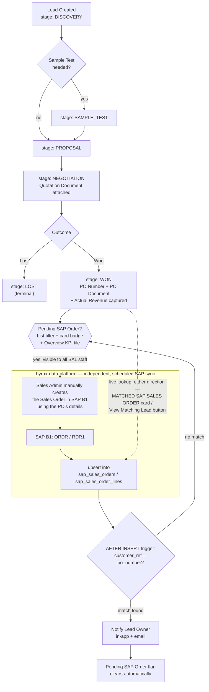

# Sales Order Pipeline — Current State & Roadmap

**Purpose of this document**: a complete, presentation-ready map of the sales pipeline from lead creation through to cash collection — what's built today, what isn't yet, and what to build next. Source material for an internal presentation; a future in-portal guide for sales staff (Help → Guides) will be adapted from this, but that adaptation is separate follow-up work, not covered here (see "Notes for the future in-portal guide" at the end).

**Relationship to existing docs**: this document narrates the pipeline end-to-end with diagrams; it doesn't replace the underlying architecture docs. For the CRM identity/forecast model, see `docs/DASHBOARD-ROADMAP.md` §1 and §5. For the SAP-side extraction plan beyond sales orders, see `hyrax-data-platform/docs/sap-data-architecture-plans/08-sales-expansion-execution-plan.md`. For the notification system's general mechanics, see `docs/NOTIFICATIONS-ARCHITECTURE.md`.

---

## Part 1 — Currently Implemented

Everything below is live in production today.

### 1.1 Lead lifecycle

A lead is created at stage `DISCOVERY` and moves through a stage graph that is **not strictly linear** — `SAMPLE_TEST` can be skipped straight to `PROPOSAL`:

| Stage | Can move to | What's captured at this transition |
|---|---|---|
| DISCOVERY | SAMPLE_TEST, PROPOSAL | — |
| SAMPLE_TEST | PROPOSAL | — |
| PROPOSAL | NEGOTIATION | — |
| NEGOTIATION | WON, LOST | **Quotation Document** (`quotation_url`, a Google Drive-linked file) — required |
| WON | *(terminal)* | **Actual Revenue**, **PO Number** (`po_number`, free-typed by the rep), **PO Document** (`po_document_url`) — all three required |
| LOST | *(terminal)* | Lose Reason (dropdown) |

A lead can also be put **On Hold** or **Cancelled** from any non-closed stage — these are independent flags, not stages themselves.

These WON/quotation fields are deliberately **not** part of the normal Edit Lead form — they only exist as one-way fields inside the guarded stage-transition action modal (`src/pages/user/sales/leads/list/LeadsManagement.jsx`), so a rep can't casually overwrite a PO number after the fact outside the transition flow. Every stage change is logged to `sales_leads_stage_history` and fires a `lead.stage_changed` notification (in-app + email) on NEGOTIATION/WON transitions.

**Quotations are native to this CRM, not SAP-sourced.** Hyrax confirmed it does not use SAP B1's own Quotation module (`OQUT`/`QUT1`) — the quotation document is just a Drive-linked file attached to the lead.

### 1.2 The PO number is the bridge — free-typed, matched live, not persisted

At WON, the rep types the customer's PO number into `sales_leads.po_number` (a real column, `UNIQUE`). This is the *only* thing connecting the CRM lead to SAP — there is no foreign key, and no persisted link row anywhere. The match happens entirely at read time: **`sap_sales_orders.customer_ref`** (SAP's `NumAtCard` field) is compared against `sales_leads.po_number` by exact string equality, wherever it's needed.

This asymmetry matters: `po_number` is unique on the lead side, but `customer_ref` has **no** uniqueness constraint on the SAP side — a single PO can legitimately end up on more than one SAP sales order (e.g. a split order). So:
- **Lead → Order** can resolve to 0, 1, or *many* rows (handled explicitly wherever this lookup happens).
- **Order → Lead** always resolves to 0 or 1 row.

### 1.3 Sales admin visibility — "who still needs to go create this in SAP"

Once a lead is WON with a PO number, nothing happens automatically in SAP — a sales admin (a `manager`-role user in the `SAL` department; there is no separate formal "Sales Admin" system role today, this is a convention, not an enforced permission tier) has to manually go into SAP B1 and create the actual Sales Order using that PO's details. To make sure that backlog doesn't get lost:

- **Leads List filter**: "Pending SAP Order" (True/False) — backed by a computed `pending_sap_order` column on the `sales_leads_with_closed_date` view: `stage = 'WON' AND po_number IS NOT NULL AND NOT EXISTS (a matching sap_sales_orders row)`.
- **Card badge**: a red "Pending SAP Order" badge on the lead's card in the List view whenever that flag is true.
- **Leads Overview KPI tile**: "Pending SAP Order Entry" — a live backlog count (deliberately *not* scoped to the dashboard's date-range filter, since this is "how many need action right now," not "how many happened in this period"), colored yellow/red once the count crosses a threshold, clicking through to the pre-filtered List.

### 1.4 SAP ingestion (independent, scheduled, owned by `hyrax-data-platform`)

Separately from anything above, `hyrax-data-platform`'s `sap_supabase` pipeline continuously syncs SAP B1 into Supabase. Relevant to this pipeline: SAP's `ORDR`/`RDR1` (Sales Order header/lines) are upserted into `sap_sales_orders`/`sap_sales_order_lines` (`ON CONFLICT (doc_entry) DO UPDATE`). This runs on its own schedule, with no awareness of the CRM side at all — it's just mirroring SAP.

### 1.5 The match — a database trigger, not application code

The moment a **genuinely new** row lands in `sap_sales_orders` (Postgres only routes a brand-new `doc_entry` through the `AFTER INSERT` trigger path under `ON CONFLICT DO UPDATE` — a re-synced/updated order never re-fires this), a trigger (`trg_notify_sales_order_po_matched` → `notify_sales_order_po_matched()`) checks whether the new order's `customer_ref` matches any lead's `po_number`. If it does:

- The lead's owner is notified **in-app and by email** ("SAP Sales Order Created for Your Lead"), linking straight to that lead.
- The lead's "Pending SAP Order" flag/badge/KPI clears automatically on next read (it's a live computed check, nothing to update).

If the lead owner has no linked portal profile, or no lead matches, the trigger silently does nothing — it never blocks or errors the SAP sync itself.

### 1.6 Bidirectional navigation once matched

- **On the Lead's detail sidebar**: a "MATCHED SAP SALES ORDER" block live-queries for any `sap_sales_orders` rows matching this lead's PO (0, 1, or many), rendering each as a clickable card that deep-links straight to that order's own detail page.
- **On the Sales Order's detail sidebar**: a "View Matching Lead" button does the reverse lookup (at most one match) and links back to the lead.
- **Copy-to-clipboard**: a small copy button sits next to the PO Number badge on the lead card, for quickly grabbing the exact PO number to search in SAP.

Both the Sales Orders pages and the Leads pages are open to **any Sales department staff**, not just managers — a deliberate access-control change made alongside this feature specifically so a non-manager lead owner notified by the trigger can actually click through and see their matched order, not just managers.

### Diagram — current, implemented flow



---

## Part 2 — Future Roadmap (not yet built)

Everything below is a genuinely separate, unbuilt piece of work. Ordered here by pipeline position, **not** by priority — see Part 3 for the recommended build order.

### 2.1 Persist the lead ↔ order link

Today's match (§1.5-1.6) is 100% computed live, every time, with no stored relationship. A dormant table, `public.sales_orders` (`sap_so_id`, `sales_lead_id`, `sales_quotation_id`), already exists for exactly this and is completely unused. Building this out (a trigger/backfill populating it on match, plus a persistent "SAP-Validated ✓" indicator on the lead) would let a WON lead's `actual_revenue` be cross-checked against real SAP figures, without unifying the two numbers (they're deliberately allowed to disagree — see `docs/DASHBOARD-ROADMAP.md` §5, Duality B). **Pure Supabase/app-side work — no new SAP data needed.**

### 2.2 Trace the sales order forward: Delivery → Invoice → Payment

**The SAP data for every one of these already exists in Supabase today** — `sap_deliveries`/`sap_delivery_lines` (SAP `ODLN`/`DLN1`), `sap_invoices`/`sap_invoice_lines` (`OINV`/`INV1`), and `sap_payments`/`sap_payment_applications` (`ORCT`/`RCT2`) have all been ingested since this pipeline's very first phase. The join chain is already populated and documented:

- Sales Order → Delivery → Invoice, via `base_entry`/`base_type` columns already captured on the line tables — **two confirmed, live branches**: an invoice can be drawn from a delivery (`base_type = 15`, `INV1.BaseEntry → ODLN.DocEntry`) *or* directly from the sales order with delivery skipped entirely (`base_type = 17`, `INV1.BaseEntry → ORDR.DocEntry`). Both happen in practice — a query that only follows one branch silently drops real rows.
- Invoice → Payment, via `sap_payment_applications`, filtered to `inv_type = 13` (the same polymorphic-FK caveat already solved for the existing RCT2 payment-matching work).

**What's actually missing is entirely on the `hyrax-central-portal` side**: Finance already has standalone Invoices and Payments pages, but they're dead-end lists with zero awareness of `sap_sales_orders` or `sales_leads`. Operations has no browsable Deliveries page at all — `sap_deliveries` is only consumed as aggregate input into Operations' dashboard KPIs. Nothing today lets anyone open a Sales Order and see "delivered? invoiced? paid?" in one place.

### 2.3 Returns / credit notes

SAP's A/R Credit Notes module (`ORIN`/`RIN1`) is not yet ingested, but per `hyrax-data-platform`'s own execution plan this is low-uncertainty — "unquestionably there," just needs a live SAP column-discovery pass before writing the extractor. Would back a return-rate KPI. Narrower value than §2.2, not part of the core fulfillment chain.

### 2.4 Production tracking

Hyrax manufactures transformer oils/lubricants, so a full pipeline view would eventually include a Production stage between "Sales Order" and "Delivery." SAP's production module (`OWOR`/`WOR1` orders, `OITT`/`ITT1` bill-of-materials, `OIGN`/`OIGE` goods receipt/issue for production) has an extensively pre-scoped target schema and KPI framework already written (`hyrax-data-platform/docs/sap-data-architecture-plans/01-sap-schema-relationships.md`, `02-department-kpi-frameworks.md`) — but **zero extraction code exists, and it's genuinely unconfirmed whether Hyrax's live SAP instance even has real, populated production-order data at all.** This is the same category of risk as SAP's Cash Flow Categories module (`OCFW`/`OCFT`), which turned out to be present but essentially unused (6 placeholder rows). A live discovery spike against SAP must happen first — building extraction or UI before that would be guessing.

### 2.5 Extending downstream notifications

The existing `sales_order.po_matched` notification pattern generalizes cleanly (see `docs/NOTIFICATION-RULES-TRACKER.csv`) to further stages once §2.2 exists to give them something to link to: invoice overdue, large payment received, delivery past its promised date, large new order created. All currently sit at "Proposed," none built.

### 2.6 Related open items (small, not pipeline-blocking)

- **"Sales Admin" isn't a formal role today** — every access rule and notification target that means "the person who enters PO details into SAP" is really just "any `manager` in `SAL`." Worth a deliberate decision if the business wants a distinct role/permission tier, rather than continuing to hand-wire this convention project to project.
- **`docs/DASHBOARD-ROADMAP.md` §6 open decision #8** ("extend the Leads Overview stage chart past WON into Sales Order Created → In Production → Delivered → Invoiced") was explicitly deferred in 2026-08 specifically because "In Production" had zero data. §2.2 above resolves three of those four legs on its own; only the Production leg remains genuinely blocked. This document's §2.2 finding is worth resurfacing against that specific open decision.

### Diagram — future/target pipeline

```mermaid
flowchart TD
    SO["Sales Order<br/>(sap_sales_orders — matched, §1)"]

    subgraph BUILT["Already ingested & joinable today — pure UI/RPC work, no new SAP extraction"]
        direction TB
        SO -->|"base_type = 17<br/>(direct, delivery skipped)"| INV["Invoice<br/>sap_invoices / sap_invoice_lines"]
        SO -->|"base_type = 17"| DEL["Delivery<br/>sap_deliveries / sap_delivery_lines"]
        DEL -->|"base_type = 15<br/>(via delivery)"| INV
        INV -->|"payment_applications,<br/>inv_type = 13"| PAY["Payment Collected<br/>sap_payments"]
    end

    subgraph BRIDGE["Sales-side, pure Supabase logic — §2.1"]
        direction TB
        BR["Persisted sales_orders bridge table<br/>+ backfill + \"SAP-Validated\" flag on Lead"]
    end
    SO -.-> BR

    subgraph SPIKE["Needs a new live-SAP investigation first — §2.4"]
        direction TB
        PROD{{"Production Order<br/>OWOR / WOR1<br/>-- go/no-go spike, unconfirmed data --"}}
    end
    PROD -.->|"if confirmed populated"| DEL

    INV --> ALERTS["Future notifications — §2.5<br/>invoice overdue · large payment received<br/>delivery past promise date · large order created"]
```

---

## Part 3 — What to build first

Ranked purely by *what's actually cheap given today's real state* — not by which sounds most impressive:

1. **§2.2, the fulfillment trace (Delivery → Invoice → Payment).** Highest value, lowest cost: every table is already syncing, every join key is already populated and documented. This is new pages/queries in `hyrax-central-portal` only. Directly resolves 3 of the 4 legs blocking `DASHBOARD-ROADMAP.md`'s deferred open decision #8.
2. **§2.1, persisting the lead ↔ order bridge.** Also cheap (pure Supabase trigger/backfill logic, dormant table already exists), and half-done already — the notification side is live, only the persisted-row/indicator half remains. Slightly lower urgency than #1 because the live lookup already covers the user-facing gap today; this is more about durability/auditability than closing a visible hole.
3. **§2.3, returns/credit notes.** Needs one live SAP discovery pass (low uncertainty, "unquestionably there" per the data platform's own plan), then a normal extractor build. Independent of #1/#2 — can slot in whenever.
4. **§2.5, downstream notifications.** Sequence after #1 — alerting on "invoice overdue" or "delivery late" is far more useful once there's an actual trace view for the alert to link into.
5. **§2.4, production tracking.** Last, and gated: run the go/no-go spike first. Everything else here (schema, KPI framework) is already designed — but no extraction or UI work should start until that spike confirms Hyrax's SAP actually has usable production-order data. Could turn out to be a dead end, same as Cash Flow's native module did.

---

## Notes for the future in-portal guide (not built in this pass)

When this content gets adapted into an actual sales-facing guide in the portal (Help → Guides tab), two things will need to change, not just the words:

- **Format**: Help's Guides tab renders short, one-paragraph markdown items inside an accordion (`src/data/help/helpGuideData.js` → `FaqAccordion`) — it has no support for a long multi-section document, tables, or diagrams today. This document's content will need to be *decomposed* into several short, tagged guide items (e.g. "How the PO number links your lead to SAP," "What 'Pending SAP Order' means"), not pasted in as one block.
- **Department scoping doesn't work yet**: guide items already carry a `departments` field in their data shape, but `HelpGuides.jsx` doesn't currently filter on it — every guide item renders for every user regardless of department. A sales-only guide would need that filtering wired up first, or it'll show to the whole company.
