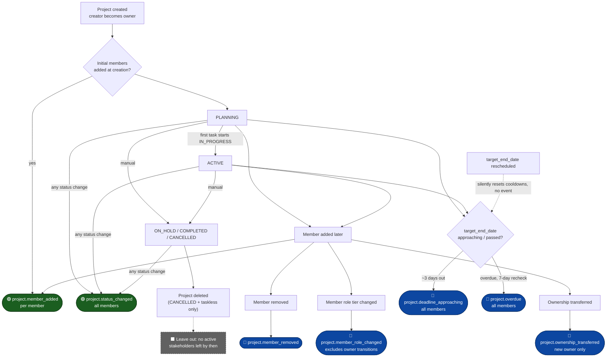
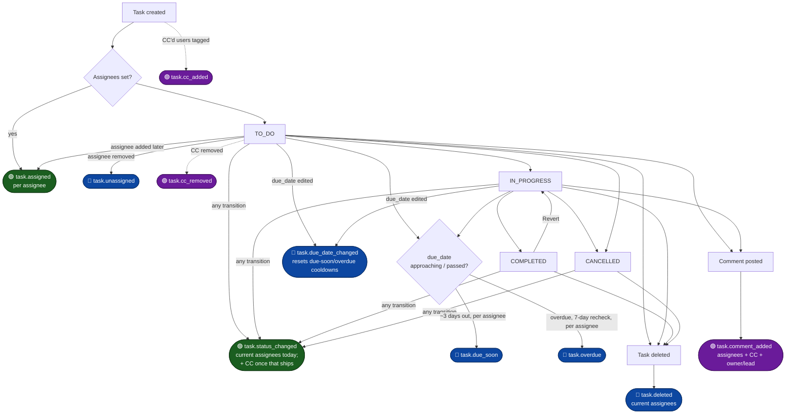
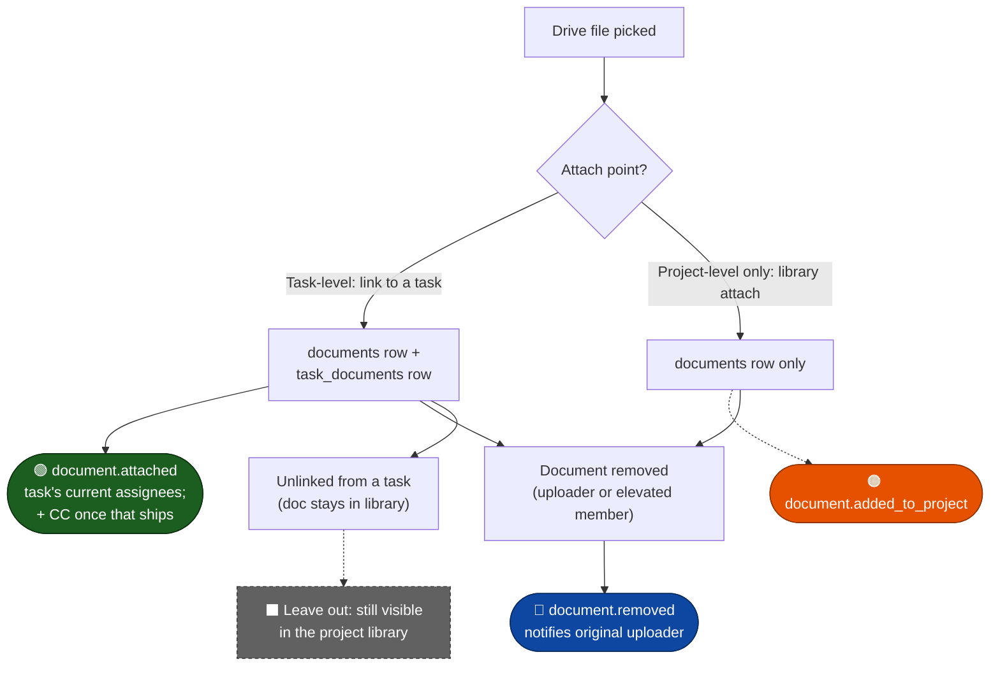

# Workspace Notifications — Full Lifecycle

This is the end-to-end map of the Projects/Tasks/Documents module's lifecycle, with every point that carries (or could plausibly carry) a notification called out. It exists so the module's notification coverage can be reasoned about as a whole, not just as a growing list of individually-shipped events — see `docs/PROJECTS-TASKS-ARCHITECTURE.md` for the module itself and `docs/NOTIFICATIONS-ARCHITECTURE.md` for the generic event/rule/fan-out engine every event below plugs into.

**Legend**: 🟢 Implemented · 🔵 Built in this pass · 🟠 Proposed (tracked, not built) · 🟣 Designed as a future feature, not built · ⬛ Considered and deliberately left out

## Project lifecycle

## Task lifecycle

## Document lifecycle

## Notes on the decisions behind this map

- **Due-soon / deadline-approaching window: 3 days.** Applies to `task.due_soon` and `project.deadline_approaching`. `task.overdue`/`project.overdue` then re-notify every 7 days until resolved (matches `check_employee_confirmations_overdue.sql`'s own recurring-cooldown cadence).
- **Dynamic multi-recipient audience for the project-level deadline events is "all project members," any role including `cc`** — matches `project.status_changed`'s existing precedent (`cc` exists specifically to stay informed).
- **`document.added_to_project`** (a document attached at the project-library level, with no task link) is deliberately left `Proposed` — correctly distinguishing it from a doc that gets task-linked moments later needs a short-delay scheduled scan, not an instant trigger, and wasn't judged worth the added latency/complexity yet.
- **`project.created`** was considered and explicitly dropped — every real stakeholder is already covered by `project.member_added` firing per initial member at creation time.
- **A task created with a due date already inside the 3-day window** isn't special-cased — the very next scheduled scan run already matches it (the condition is satisfied from the moment the row exists), and `task.assigned`'s own notification message surfaces the due date immediately regardless of scan timing.
- **Silent cooldown resets** (project deadline rescheduled, task due date rescheduled) intentionally carry no visible notification of their own — only clear the reminder state so the new date gets a fresh cycle. Adding a separate "deadline changed" notification on top was weighed and left out to avoid over-notifying.
- **Task CC and Task Comments** are new capabilities the module doesn't have yet — designed in `docs/TASK-CC-DESIGN.md` and `docs/TASK-COMMENTS-DESIGN.md`, not implemented in this pass. Once built, `task.status_changed` and `document.attached`'s recipient loops extend to include CC'd users (documented as a follow-up in the Task CC design doc).

## Fixed alongside this pass

The five originally-shipped Workspace `notify_*` functions (`task.assigned`, `project.member_added`, `task.status_changed`, `project.status_changed`, `document.attached`) were not `security definer` — meaning the `employees` lookup used to resolve a *target's* `profile_id` ran under the *acting* user's own RLS, which only grants self/HR/superadmin/direct-manager visibility into `employees`. An ordinary "member" notifying another ordinary "member" they aren't managing would silently resolve to no recipient and never fire. All five, plus every new function in this pass, are now `security definer set search_path = ''`.
