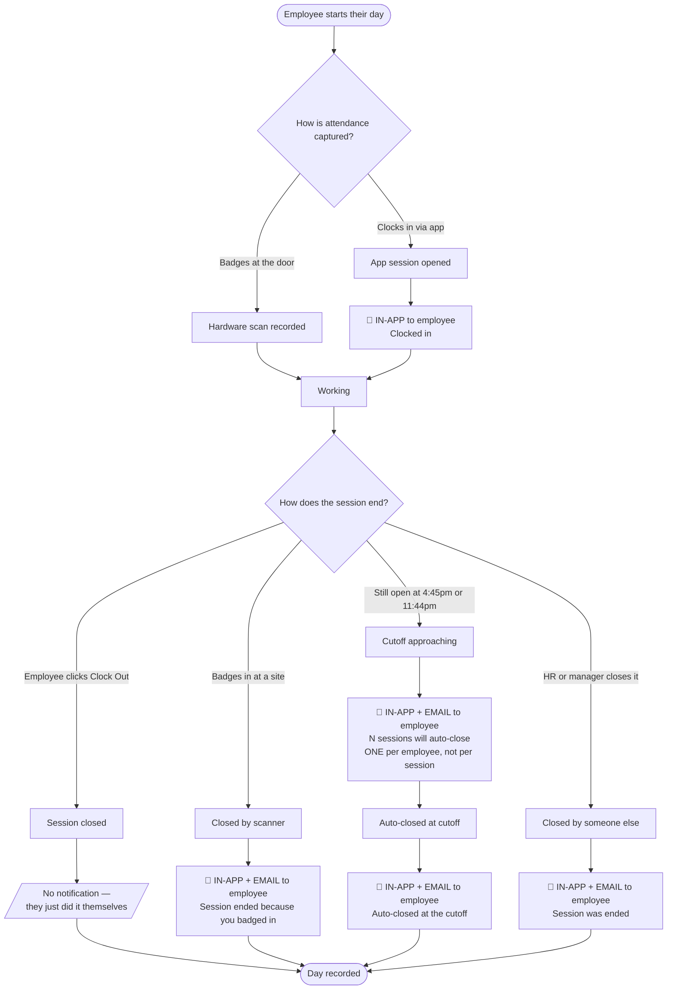
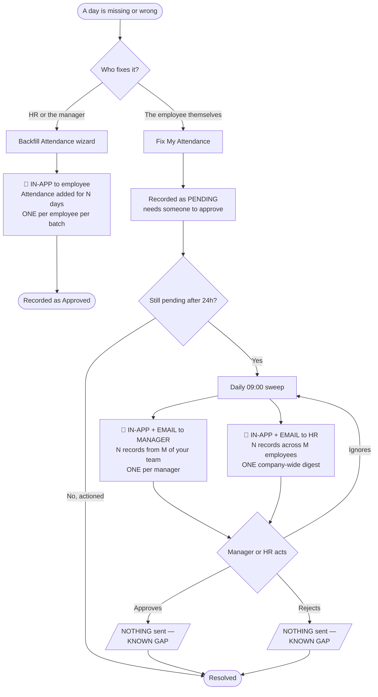
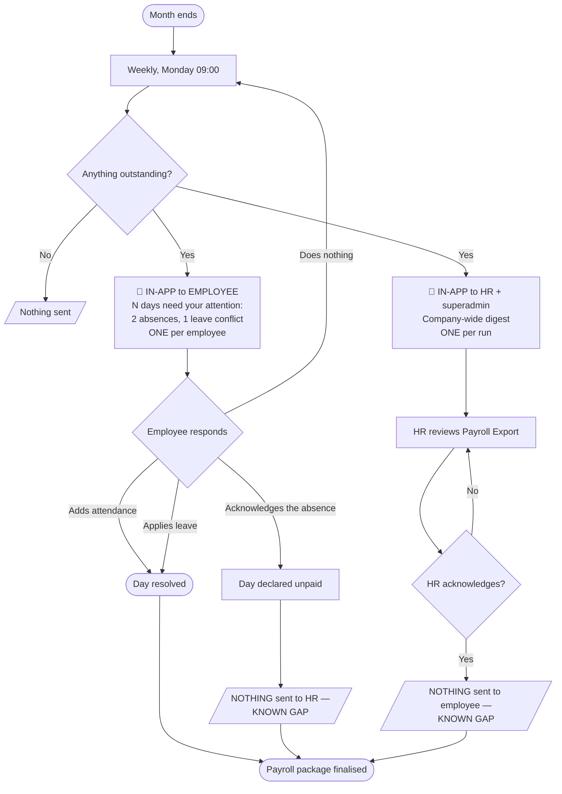

# Attendance & Payroll Notifications — the whole lifecycle

What the portal sends, to whom, and what triggers it — from an employee
clocking in on a Tuesday to HR exporting the payroll package a month later.

The live rules are exported to
[`docs/portal/NOTIFICATION-RULES.csv`](../portal/NOTIFICATION-RULES.csv) by
`supabase/diagnostics/export_notification_rules.sql`. That file is the source
of truth for **who receives** each notification; this document explains **why
each exists** and where it sits in the lifecycle.

---

## The design rule

Every notification here is one of two shapes, and which one is not a style
choice:

| Shape | When to use it | Example |
|---|---|---|
| **Per-event** | Something specific just happened **to** this person | "Your session was closed at the 5pm cutoff" |
| **Consolidated** | This person has a **queue** to work through | "6 records from 3 of your team are waiting for approval" |

A consolidated notification carries a **count** and links to a **filtered
list**, never to a single record. It is sent once per recipient, not once per
item.

> **This is not cosmetic.** Before this was applied, the pending-approval
> notification sent one message per pending row to the manager *and every
> person in HR*. One employee fixing ten days of their own attendance produced
> **ten notifications to every HR person**, repeating daily. Consolidation is
> what makes the difference between a queue you work and a queue you mute.

---

## Part 1 — The daily cycle

**Why "clocked out" is silent when self-initiated.** It used to fire on every
close, including the employee pressing the button — an in-app notification *and
an email* confirming something they did three seconds earlier, every working
day. It now only fires when something or someone **else** ended the session,
which is genuinely worth knowing.

---

## Part 2 — Fixing a missing or incomplete day

**The link matters as much as the count.** The manager's notification opens
**Team Attendance filtered to Pending Approval**; HR's opens the **HR
Attendance list**, same filter. Previously both received the same bare HR path
— a dead link for managers, who have no HR route access.

**Note the loop.** If nobody acts, the sweep re-sends every 24 hours. That is
intentional for a live queue — but it also means an ignored backlog keeps
generating noise, which is the strongest argument for actioning it.

---

## Part 3 — The monthly reconciliation cycle

**Two things this cycle gets right that it previously did not:**

- **Acknowledged days stop nagging.** The reminder used to count the raw flags
  with no acknowledgement check, so once a day was acknowledged the employee
  kept being reminded about it every week, indefinitely, with no way to stop
  it. Acknowledging is the mechanism that exists to close these.
- **Employees are not chased about approvals.** Hours awaiting approval count
  as outstanding for payroll, but the employee cannot approve their own entry.
  That category is excluded from their reminder and chased to the manager and
  HR instead — the people who can act.

---

## The full list

| # | Notification | Trigger | Who | Shape | Channels |
|---|---|---|---|---|---|
| 1 | Clocked in | App clock-in | Employee | per event | in-app |
| 2 | Auto clock-out approaching | 16:45 & 23:44 daily | Employee | **1 per employee** | in-app + email |
| 3 | Clocked out | Session closed by scanner, sweep, or another person | Employee | per event | in-app + email |
| 4 | Attendance backfilled | HR/manager runs the wizard | Employee | **1 per batch** | in-app |
| 5 | Approvals pending → manager | 09:00 daily, pending >24h | Manager | **1 per manager** | in-app + email |
| 6 | Approvals pending → HR | 09:00 daily, pending >24h | HR | **1 company-wide** | in-app + email |
| 7 | Reconciliation outstanding | Monday 09:00 | Employee | **1 per employee** | in-app |
| 8 | Reconciliation digest | Monday 09:00 | HR + superadmin | **1 company-wide** | in-app |

Email is deliberately absent from 7 and 8 — automated bulk email to real
employee addresses is deferred until the app leaves testing. The manual "Send
Email" button on Payroll Export is unaffected and remains the only way an
email actually goes out for reconciliation.

---

## Known gaps

**1. Nothing is sent when a request is resolved.** Approving, rejecting and
acknowledging all emit nothing. An employee submits a backfill, gets chased
about it for days, then hears silence when it is finally approved — and has no
way to know except by going to look. This is the clearest remaining gap and the
smallest to close: three functions, one `emit_notification_event` call each.

**2. HR is not told when an employee self-acknowledges an absence.** That
action declares a day unpaid. It is the correct outcome and the employee is
permitted to do it, but HR finding out only by re-reading the Payroll Export is
thin for something with a pay consequence.

**3. `docs/hr/ATTENDANCE-DAILY-ALERTS-DESIGN.md` is not built, and should be
revisited before it is.** It proposes **17 event types, one per employee-day
per flag** — which is precisely the per-row shape this lifecycle was just
restructured to remove. Built as designed, it would send more notifications per
day than everything above combined.

---

## Related

- [`ATTENDANCE-DAY-MODEL.md`](./ATTENDANCE-DAY-MODEL.md) — what the day labels
  and reconciliation categories mean
- [`../portal/NOTIFICATION-RULES.csv`](../portal/NOTIFICATION-RULES.csv) — the
  live rules export
- `supabase/diagnostics/export_notification_rules.sql` — regenerates that CSV,
  plus checks for duplicate rules, rules matching nobody, and events firing
  with no rule
